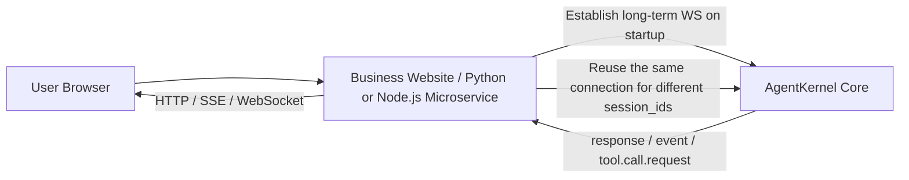
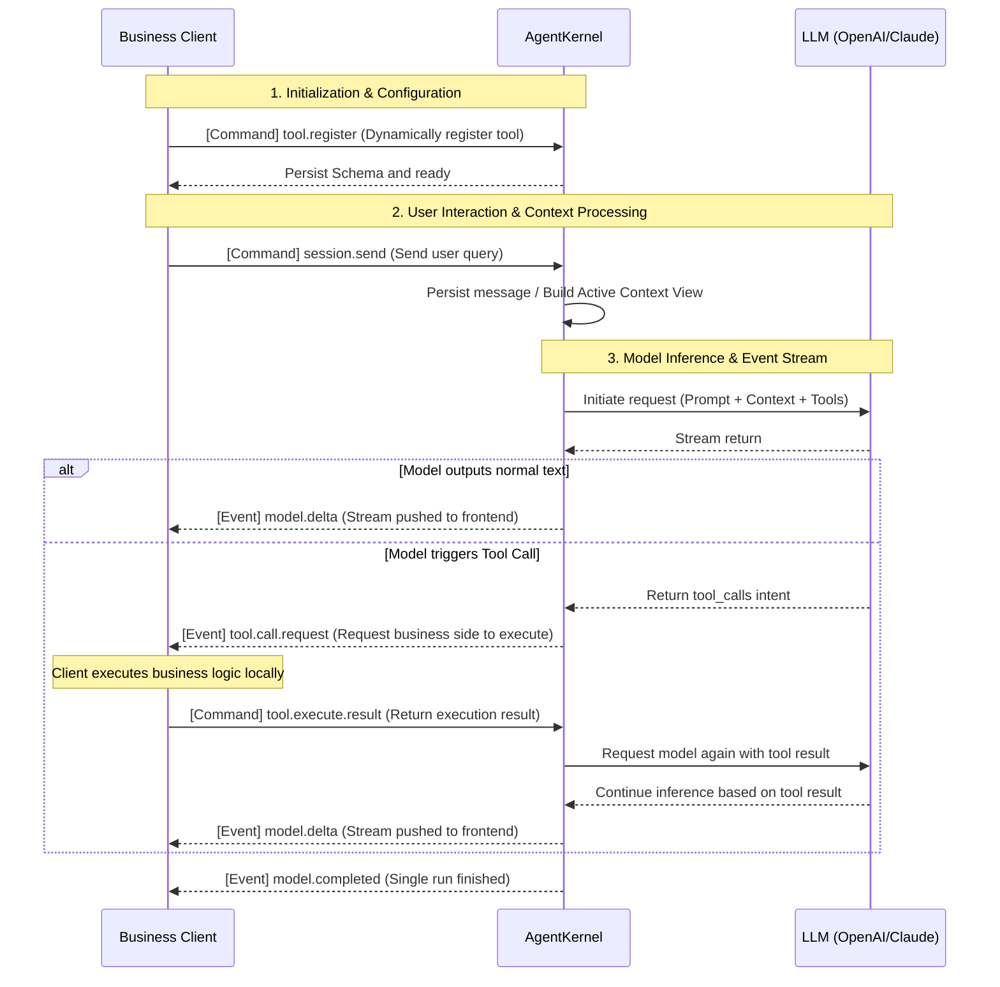

<div align="right">
  <strong>English</strong> | <a href="./README_zh.md">简体中文</a>
</div>

<div align="center">
  <h1>🚀 AgentKernel</h1>
  <p><b>A lightweight, embeddable, WebSocket-driven AI Runtime Kernel</b></p>
  <p>
    <a href="https://github.com/cih1996/AgentKernel/stargazers"></a>
    <a href="https://github.com/cih1996/AgentKernel/blob/main/LICENSE"></a>
    
  </p>
</div>

<br />

> 💡 **An ultra-lightweight Agent kernel that makes integrating AI into your projects a breeze!**
> Zero-embedding, high concurrency—using it is as simple as using an object.
> Everything communicates via the WebSocket protocol, requiring no tight coupling to your project code. A completely independent microservice!

**🌐 Online Demo:** [https://cih1996.github.io/AgentKernel/](https://cih1996.github.io/AgentKernel/)

## 🚀 Introduction

**Tool capabilities, Skills, and MCP can be freely and dynamically hot-plugged, registered, and invoked via callbacks.**

Various event callbacks are pre-packaged, saving you from reinventing the wheel:
1. **Context Management**: Context activation, truncation, injection, threshold detection, and full-history queries.
2. **Multi-Model Compatibility**: Compatible with providers like OpenAI, Claude, and Ollama.
3. **Dynamic Tool Dispatch**: Real-time registration of capability tools, executed by you via callbacks, including MCP.

**You can even build the next Open Code, Claude Code, OpenClaw, etc.!**
Because it serves as the core communication base for AI, you no longer need to worry about provider compatibility, TOOL protocols, or context management. Everything is encapsulated, yet remains fully dynamic and customizable in real-time!

## 🎯 Core Positioning

AgentKernel is neither a Chat UI nor a Business Agent, but an **Agent Runtime Kernel**.

**Core Principle: The Kernel handles the runtime; the Business Side handles the orchestration.**

| ⚙️ AgentKernel (Runtime Core)       | 🧠 Business Side (Application Orchestration)           |
| :--------------------------- | :---------------------- |
| **Model Interaction**: Model calls, concurrency scheduling | **Tool Implementation**: Specific tool execution logic and permissions |
| **State Management**: Session management, persistent storage | **Business Logic**: Business prompts, memory system extraction |
| **Context**: Context building, exposing threshold events | **Compression Strategy**: MCP orchestration, smart context compression |
| **Communication Protocol**: WebSocket IPC, event stream distribution | **Frontend Interaction**: Final product UI display |

> 💡 **Integration Note**
> AgentKernel is better suited as a "single execution system" Runtime core: the same business execution side can reuse multiple `session`s.\
> For multi-user shared sessions or collaborative viewing, it is recommended that the business side handles distribution, broadcasting, and permission control at the upper layer, rather than having multiple client endpoints directly connect to the same `session` in the Core.\
> The Core is responsible for the runtime and protocol boundaries, not multi-user collaborative orchestration.

### Recommended Integration Method



- It is recommended that the business service maintains a long-term WebSocket connection with the Core upon startup, and reuses this connection to process multiple `session`s.
- User requests first enter the business service, which then determines the `session`, permissions, context, and tool execution.
- For multi-user shared sessions, it is recommended to broadcast and distribute internally within the business service. Do not let multiple user endpoints directly connect to the Core's same `session`.

## 🏗️ Architecture & Principles

AgentKernel uses **WebSocket** as its core bidirectional communication protocol to achieve complete decoupling of state and control:



### ✨ Core Features

1. **🔌 Dynamic Hot-Pluggable Tool Capabilities**: No need to modify Kernel source code. The business side dynamically registers tool definitions via WS, receives `tool.call.request`, executes locally, and returns the result.
2. **📚 Full History and Controllable Views**: Message Logs are permanently retained, but an Active Context View is provided. The Kernel only exposes threshold events and does not hardcode compression strategies, leaving it to the business side's discretion.
3. **⚡ Event Streams as First-Class Citizens**: Proactively pushes states like `model.delta` and `tool.call.request` during execution. If the provider supports reasoning/thinking stream passthrough, it also outputs via `model.delta.payload.event_type = "thinking"`, facilitating debugging and distributed deployment.
4. **🪶 Extremely Lightweight**: Does not have built-in heavy memory systems, rule libraries, or skill markets. Sticks to its boundaries, acting purely as a cross-platform reusable Runtime.

## ⚖️ Use Case Comparison

| ✅ Suitable for AgentKernel                                                                  | ❌ Unsuitable Scenarios                                                                   |
| :------------------------------------------------------------------------------------ | :------------------------------------------------------------------------- |
| - Adding AI Runtime to existing business systems/Web<br>- Developing cross-language automated script systems<br>- Building the foundation for multi-Agent orchestration platforms<br>- Creating Agent running nodes similar to ComfyUI | - Only needing a simple one-off LLM API call<br>- Needing an out-of-the-box complete Coding Agent (like Cursor/Aider)<br>- Looking for a ready-made Chat UI product |

## 🚀 Quick Start

First, start the Core:

```bash
git clone https://github.com/cih1996/AgentKernel.git
cd AgentKernel
cargo run
```

- `cargo run` starts the **headless Core service**.
- Default WebSocket address: `ws://localhost:9991/ws`
- If your default binary is not the server, you can explicitly use `cargo run -p agentkernel-server`

If you need a local web debugging console, start it separately:

```bash
cd web
python3 server.py
```

- Default debug page address: <http://127.0.0.1:8899>
- `web/server.py` will first check if the Core is running; if not, it will prompt and exit directly.
- The recommended sequence is to start the Core first, then the debug page.

> 💡 For official business integration, it is recommended to keep your Python / Node.js / Go / Rust service persistently connected to the Core, and reuse the connection with different `session_id`s. If a user needs to "stop generating", the business service should send `run.cancel`. Do not let multiple end clients directly compete for the same shared `session`.

## 📦 Storage Structure & API

<details>
<summary><b>📂 View Storage Structure</b></summary>

Currently, file-based persistence is prioritized for easy debugging and viewing full logs (SQLite will be introduced as the main storage later):

```text
.aicore/
└── sessions/
    └── <session_id>/
        ├── session.json
        ├── messages.jsonl
        ├── events.jsonl
        └── ...
```

</details>

<details>
<summary><b>🔌 View WebSocket Protocol Example</b></summary>

**Send Message**

```json
{
  "command": "session.send",
  "session_id": "debug",
  "payload": { "message": "Get current time" }
}
```

**Register Tool**

```json
{
  "command": "tool.register",
  "session_id": "debug",
  "payload": { "tool_name": "get_time", "schema": { "type": "object" } }
}
```

**Receive Call and Return Result**

```json
// Kernel -> Client (Event)
{
  "type": "event",
  "event_type": "tool.call.request",
  "payload": { "tool_name": "get_time", "call_id": "xxx" }
}

// Client -> Kernel (Command)
{
  "command": "tool.execute.result",
  "payload": { "call_id": "xxx", "result": "2026-05-18 08:30:00" }
}
```

</details>

## 📸 Debug Console Screenshots

<table>
  <tr>
    <td align="center"><br>Runtime Console</td>
    <td align="center"><br>Session Management</td>
    <td align="center"><br>Tool Runtime</td>
  </tr>
  <tr>
    <td align="center"><br>Event Stream</td>
    <td align="center"><br>Raw Messages</td>
    <td align="center"><br>Config and Prompt</td>
  </tr>
</table>

## 🗺️ Roadmap & Community

- [ ] Complete Context operations and Compaction workflow
- [ ] Tool call ACK / Idempotent state queries
- [ ] SQLite main storage and multi-client permission boundaries
- [ ] SDK Examples (JS / Python / Go)

**License:** MIT<br>
**Community Chat:** QQ Group `250892941`

[](https://www.star-history.com/#cih1996/AgentKernel\&Date)
