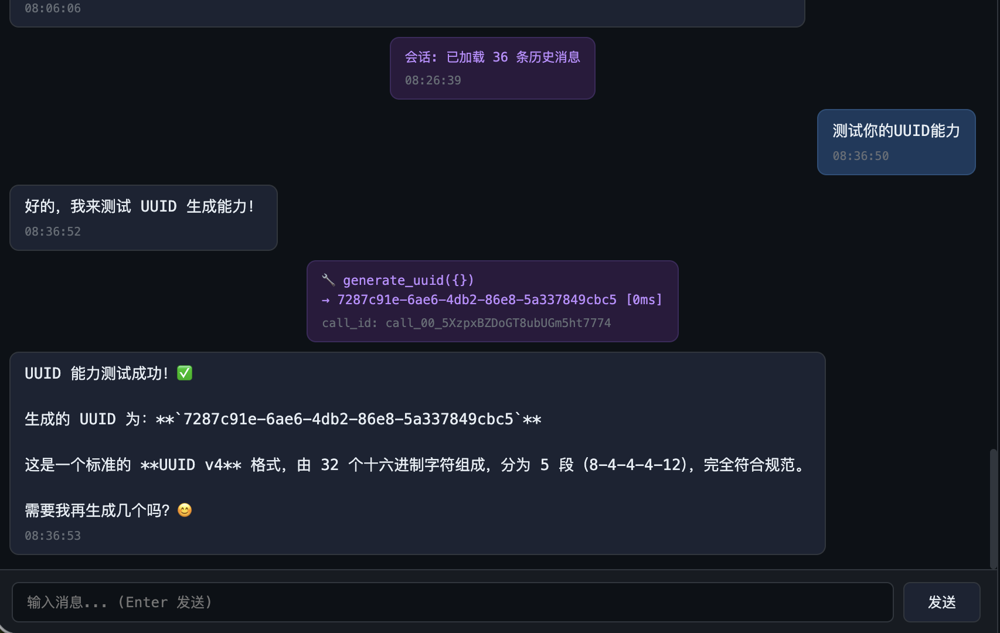
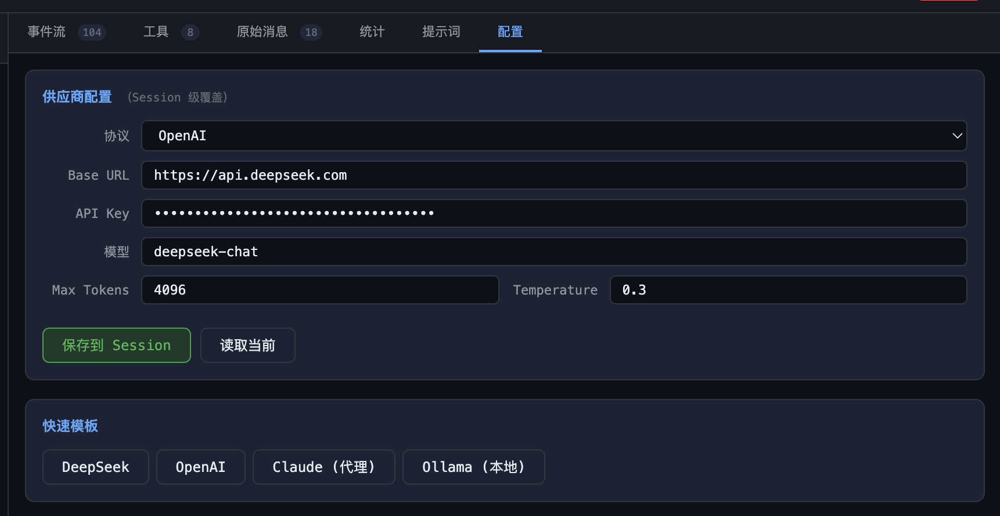
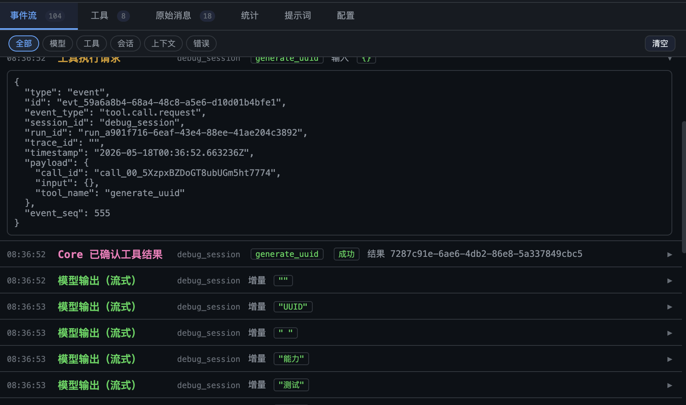
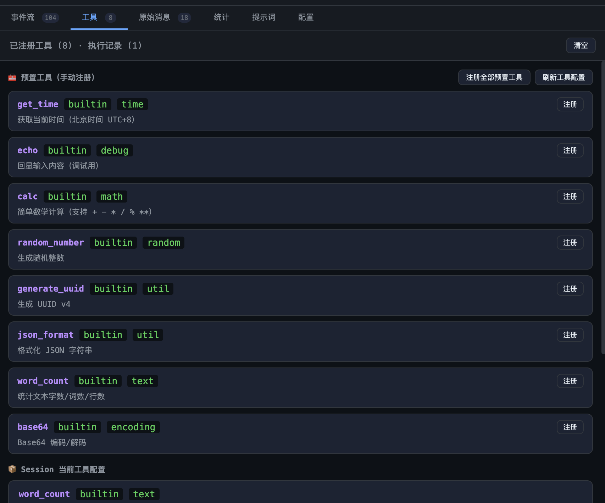
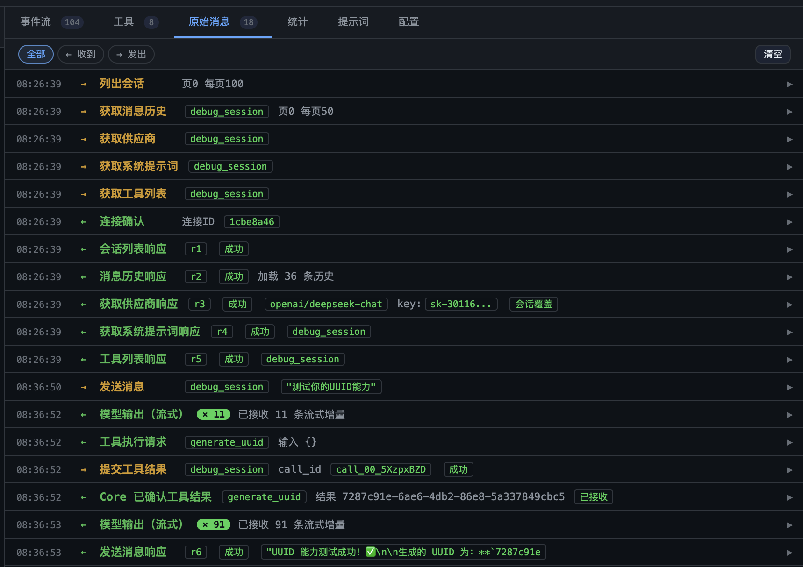
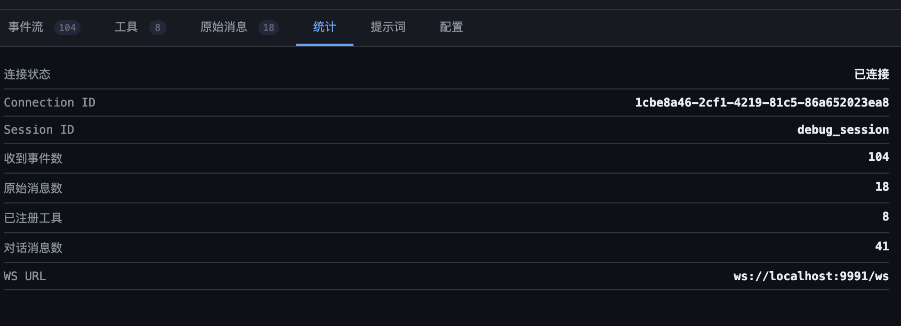

# AgentKernel

> 一个轻量、可嵌入、WebSocket 驱动的 AI Runtime Kernel。  
> 让你的网页、脚本、服务端项目不再反复从 0 写 Agent Runtime。



## 为什么做 AgentKernel？

我一直想做一个类似 Claude Code 的“基座”。Claude Code 的工程能力很强，但它本身很重，也内置了大量偏工程化的工具能力。很多场景里，我们只是想把 AI Runtime 嵌入自己的产品、网页、脚本或自动化系统，并不一定需要完整的 CLI 工程代理。

真正麻烦的不是“调用一次 LLM”，而是一旦你要做长期运行的 Agent Runtime，就会反复遇到这些问题：

- Session 怎么管理？
- 上下文怎么持久化？
- 工具怎么动态注册、调用、回传？
- 模型流式输出、工具调用、错误、阈值提醒怎么统一事件化？
- 多语言项目怎么复用同一套 Agent 能力？
- 不同模型供应商怎么切换？

所以 AgentKernel 的目标很明确：

**把 AI Runtime 做成一个独立 Kernel。**

以后不管你开发 Python、Go、Node.js、PHP、Rust、Web 项目，业务端只需要连接 AgentKernel 的 WebSocket，就可以复用同一套 Session、Context、Tool、Event、Storage、Trace 能力。

## 核心定位

AgentKernel 不是聊天 UI，也不是业务 Agent。

它是一个：

```text
Agent Runtime Kernel / AI Runtime Core
```

它负责运行时核心能力：

- 模型调用
- Session 管理
- Context 构建
- 工具注册与调度
- WebSocket IPC
- 事件流
- 持久化存储
- Trace 追踪
- 调试控制台

业务端负责：

- 具体工具实现
- 业务权限
- 业务提示词
- 记忆系统
- MCP / 技能系统
- 上下文压缩策略
- 产品 UI

换句话说：

**Kernel 只管运行时，业务端只管编排。**

## 架构理念



AgentKernel 采用 WebSocket 作为核心通信协议。

所有操作都是 Command：

```text
client -> AgentKernel
```

所有运行状态都是 Event：

```text
AgentKernel -> client
```

这意味着业务端可以动态完成：

- 注册工具
- 更新供应商配置
- 设置 system prompt
- 发送用户消息
- 接收模型增量输出
- 接收工具调用请求
- 回传工具执行结果
- 监听上下文阈值事件
- 读取 session 历史

## 核心亮点

### 1. 不需要改 Kernel 源码

AgentKernel 的目标是：编译、运行，然后通过 WebSocket 动态配置。

你想让它拥有什么能力，不需要改 Kernel 源码，而是通过 WS 注册工具声明：

```json
{
  "command": "tool.register",
  "session_id": "debug_session",
  "payload": {
    "tool_name": "get_time",
    "description": "获取当前时间",
    "schema": {
      "type": "object",
      "properties": {
        "format": { "type": "string" }
      }
    },
    "client_id": "my-app"
  }
}
```

当模型需要调用工具时，Kernel 会通过事件主动推送：

```json
{
  "type": "event",
  "event_type": "tool.call.request",
  "session_id": "debug_session",
  "payload": {
    "tool_name": "get_time",
    "call_id": "tool_xxx",
    "input": { "format": "locale" }
  }
}
```

业务端执行完成后，再把结果回传给 Kernel。

### 2. 全量历史保留，但不盲目全量提交

AgentKernel 的 Message Log 永久保留，但模型请求使用的是 Active Context View。

也就是说：

```text
历史记录完整保存
但提交给模型的是可控上下文视图
```

未来你可以自由选择：

- 直接裁剪上下文
- 调用新的 compact agent 做智能压缩
- 注入 summary seed
- 重置当前 context
- 排除某些历史区间

Kernel 只负责检测阈值并发事件，不硬编码你的压缩策略。

### 3. 工具能力动态热插拔



工具不是写死在 Kernel 里，而是由业务端动态注册。

这让 AgentKernel 可以很轻：

- 你做浏览器 Agent，就注册 browser 工具
- 你做 Android Agent，就注册 adb 工具
- 你做数据分析，就注册 database / python 工具
- 你做业务系统，就注册自己的业务 API 工具

Kernel 不关心工具怎么执行，只负责：

1. 保存工具定义
2. 告诉模型有哪些工具
3. 接收模型 tool_use
4. 通过 WS 发送 tool.call.request
5. 等待业务端 tool.execute.result
6. 把 tool_result 回填给模型继续推理

### 4. 事件流是运行时的一等公民



AgentKernel 会在运行过程中主动推送事件，例如：

- `model.delta`：模型流式输出
- `model.completed`：模型完成
- `tool.call.request`：请求业务端执行工具
- `tool.call.result`：Kernel 已确认工具结果
- `context.threshold.reached`：上下文达到阈值
- `error`：运行错误

事件流不是轮询查询结果，而是 Runtime 执行过程中主动上报。

这对调试、可视化、业务编排、分布式 Agent 都很关键。

### 5. 保持轻量，不内置重型记忆/规则/技能系统

AgentKernel 当前不内置复杂的：

- 长期记忆系统
- 规则库
- 技能市场
- MCP 编排
- 业务 Agent 模板

这不是缺点，而是边界。

这些能力完全可以由业务端通过工具、prompt、context seed、外部服务去实现。Kernel 保持干净，才能被更多项目复用。

## 当前能力

- Rust workspace 架构
- WebSocket Runtime Protocol
- OpenAI-compatible / Claude 协议适配
- Session 级 provider 配置
- Session 级 system prompt
- 文件式 session 持久化
- 消息历史 JSONL 保存
- 工具动态注册 / 注销
- 工具调用 WS 路由
- 多工具调用并发执行与聚合回填
- 模型流式输出事件
- 上下文阈值事件
- 调试 Web Console
- 原始 WS 消息可视化
- 事件流中文可视化

## 存储结构

当前阶段优先使用文件式持久化，方便调试 Runtime 协议和查看全量日志。

```text
.aicore/
└── sessions/
    └── <session_id>/
        ├── session.json
        ├── messages.jsonl
        ├── runs.jsonl
        ├── events.jsonl
        ├── context_state.json
        └── seeds.jsonl
```

SQLite 会作为后续主存储目标保留。

## 快速开始

### 1. 克隆项目

```bash
git clone https://github.com/cih1996/AgentKernel.git
cd AgentKernel
```

### 2. 配置 API Key

OpenAI-compatible，例如 DeepSeek：

```bash
export OPENAI_API_KEY="sk-..."
```

Claude：

```bash
export CLAUDE_API_KEY="sk-..."
```

### 3. 构建

```bash
cargo build --release
```

### 4. 启动

默认 OpenAI-compatible / DeepSeek：

```bash
./target/release/agentkernel \
  --addr 0.0.0.0:9991 \
  --protocol openai \
  --base-url https://api.deepseek.com \
  --model deepseek-chat
```

Claude 协议：

```bash
./target/release/agentkernel \
  --addr 0.0.0.0:9991 \
  --protocol claude \
  --model claude-sonnet-4-20250514
```

然后打开：

```text
http://localhost:9991
```

WebSocket 地址：

```text
ws://localhost:9991/ws
```

## WebSocket 协议示例

### 发送消息

```json
{
  "command": "session.send",
  "request_id": "r1",
  "session_id": "debug_session",
  "payload": {
    "message": "帮我获取当前时间"
  }
}
```

### 注册工具

```json
{
  "command": "tool.register",
  "request_id": "r2",
  "session_id": "debug_session",
  "payload": {
    "tool_name": "get_time",
    "description": "获取当前时间",
    "schema": {
      "type": "object",
      "properties": {
        "format": {
          "type": "string",
          "description": "输出格式: iso / locale / timestamp"
        }
      }
    },
    "client_id": "web_debug",
    "timeout_ms": 15000,
    "tags": ["time"]
  }
}
```

### 接收工具调用事件

```json
{
  "type": "event",
  "event_type": "tool.call.request",
  "session_id": "debug_session",
  "run_id": "run_xxx",
  "payload": {
    "tool_name": "get_time",
    "call_id": "toolu_xxx",
    "input": {
      "format": "locale"
    }
  }
}
```

### 回传工具结果

```json
{
  "command": "tool.execute.result",
  "request_id": "r3",
  "session_id": "debug_session",
  "payload": {
    "call_id": "toolu_xxx",
    "result": "2026-05-18 08:30:00",
    "is_error": false
  }
}
```

## 调试控制台截图

### Runtime Console


### Session 管理


### 工具注册与执行


### 事件流


### 原始消息可视化



### 配置与提示词



## 适合什么场景？

AgentKernel 很适合这些方向：

- 给现有业务系统接入 AI Runtime
- 做网页 Agent
- 做浏览器自动化 Agent
- 做 Android / iOS 自动化 Agent
- 做多语言脚本自动化系统
- 做本地 AI 助手
- 做多 Agent 编排平台
- 做 ComfyUI 式 Agent Runtime
- 做云端 Agent SaaS 的底层 runtime

## 不适合什么场景？

如果你只想简单调用一次 LLM，AgentKernel 可能太重。

如果你想要开箱即用的完整 Coding Agent，Claude Code / Cursor / Aider 这类产品会更直接。

AgentKernel 的价值在于：

```text
你要做自己的 AI 产品，但不想每次重写 Agent Runtime。
```

## 关于演示视频

建议优先上传到以下位置：

1. **GitHub Release Assets**  
   适合放正式演示视频，和版本绑定，仓库读者下载方便。

2. **YouTube / Bilibili**  
   适合社区传播，README 里放封面图和链接。

3. **GitHub Issues / Discussions 附件**  
   适合临时演示，但不如 Release 正式。

不建议直接把大视频提交进 Git 仓库，会显著增大仓库体积。  
如果视频较短，也可以转成 GIF 或 WebP 放到 `assets/`，但正式演示视频更推荐 Release 或 B 站。

## 路线图

- [ ] 更完整的 Context 操作命令
- [ ] Context compaction workflow
- [ ] Tool call ACK / 幂等状态查询
- [ ] SQLite 主存储
- [ ] 更完整的 Trace / Replay
- [ ] 多 client 权限边界
- [ ] SDK 示例：JavaScript / Python / Go
- [ ] 可选内置通用工具能力

## License

MIT
