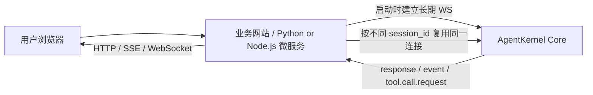
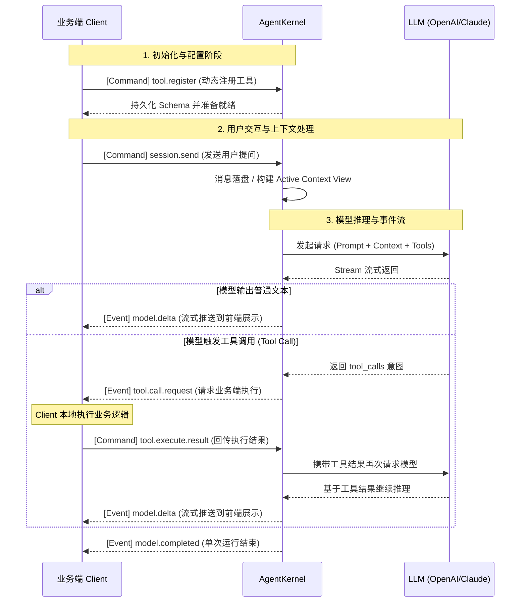

<div align="right">
  <a href="./README.md">English</a> | <strong>简体中文</strong>
</div>

<div align="center">
  
  <h1>🚀 AgentKernel</h1>
  <p><b>一个轻量、可嵌入、WebSocket 驱动的 AI Runtime Kernel</b></p>
  <p>
    <a href="https://github.com/cih1996/AgentKernel/stargazers"></a>
    <a href="https://github.com/cih1996/AgentKernel/blob/main/LICENSE"></a>
    
  </p>
</div>

<br />

> 💡 **超轻量级 Agent 内核，将 AI 接入项目不再是难事！**
> 0 嵌入式，高效并发，使用它，就像使用对象这么简单。
> 所有方式均通过 WebSocket 协议通讯，无需强嵌入到你的项目代码，完全独立运行的微服务！

**🌐 在线演示：** [https://cih1996.github.io/AgentKernel/](https://cih1996.github.io/AgentKernel/)<br>
**📺 视频教程 (如何接入项目)：**

<div align="center">
  <a href="https://youtu.be/iSo_Ux1AcRw?si=JGDLmntvuN51CmoT">
    
  </a>
</div>

## 🚀 简介

**工具能力、Skill、MCP 均可自由动态热插拔注册，回调。**

包装好了各类事件回调，不用再重新造轮子：
1. **上下文管理**：上下文激活，裁剪，注入，阈值检测，全量查询。
2. **多模型兼容**：供应商兼容 OpenAI、Claude、Ollama。
3. **工具动态调度**：能力工具实时注册、通过回调由你执行、包括 MCP。

**你甚至可以打造下一个 Open Code、Claude Code、OpenClaw 等！**
因为它是 AI 通讯的内核基座，你不需要再关心供应商兼容问题、TOOL 协议问题、上下文的管理问题，全部已经封装好，但仍可以任由你实时动态调配！

## 🎯 核心定位

AgentKernel 不是聊天 UI，也不是业务 Agent，而是 **Agent Runtime Kernel**。

**核心原则：Kernel 只管运行时，业务端只管编排。**

| ⚙️ AgentKernel (运行时核心)       | 🧠 业务端 (应用编排)           |
| :--------------------------- | :---------------------- |
| **模型交互**：模型调用、并发调度           | **工具实现**：具体工具执行逻辑与权限    |
| **状态管理**：Session 管理、持久化存储    | **业务逻辑**：业务提示词、记忆系统提取   |
| **上下文**：Context 构建、主动暴露阈值事件  | **压缩策略**：MCP 编排、智能上下文压缩 |
| **通信协议**：WebSocket IPC、事件流分发 | **前端交互**：最终产品 UI 展示     |

> 💡 **接入注意**
> AgentKernel 更适合作为“单一执行体系”的 Runtime 内核：同一套业务执行端可复用多个 `session`。\
> 如果是多用户共享会话或协同查看，建议由业务端在上层做分流、广播和权限控制，而不是让多个用户端直接连接 Core 的同一个 `session`。\
> Core 负责运行时与协议边界，不负责多用户协同编排。

### 推荐接入方式



- 推荐由业务服务在启动时与 Core 保持长期 WebSocket 连接，后续复用这条连接处理多个 `session`。
- 用户请求先进入业务服务，再由业务服务决定 `session`、权限、上下文和工具执行。
- 如果是多人共享会话，建议由业务服务内部做广播和分流，不要让多个用户端直接连接 Core 的同一个 `session`。

## 🏗️ 架构与原理

AgentKernel 采用 **WebSocket** 作为核心双向通信协议，实现状态与控制的完全解耦：



### ✨ 核心特性

1. **🔌 工具能力动态热插拔**：无需修改 Kernel 源码。业务端通过 WS 动态注册工具定义，接收 `tool.call.request` 后在本地执行并回传结果。
2. **📚 全量历史与可控视图**：Message Log 永久保留，但提供 Active Context View。Kernel 只暴露阈值事件，不硬编码压缩策略，交由业务端自由裁量。
3. **⚡ 事件流即一等公民**：运行过程中主动推送 `model.delta`、`tool.call.request` 等状态；如果供应商支持 reasoning / thinking 流式透传，也会通过 `model.delta.payload.event_type = "thinking"` 往外输出，方便调试与分布式部署。
4. **🪶 保持极致轻量**：不内置重型的记忆系统、规则库或技能市场。坚守边界，只做跨平台复用的 Runtime。

## ⚖️ 适用场景对比

| ✅ 适合 AgentKernel 的场景                                                                  | ❌ 不适合的场景                                                                   |
| :------------------------------------------------------------------------------------ | :------------------------------------------------------------------------- |
| - 给现有业务系统/Web接入 AI Runtime- 开发跨语言自动化脚本系统- 构建多 Agent 编排平台底层- 打造类似 ComfyUI 的 Agent 运行节点 | - 只需要简单调用一次 LLM 接口- 需要开箱即用的完整 Coding Agent (如 Cursor/Aider)- 寻找现成的聊天 UI 产品 |

## 🚀 快速开始

先启动 Core：

```bash
git clone https://github.com/cih1996/AgentKernel.git
cd AgentKernel
cargo run
```

- `cargo run` 启动的是**无前端的 Core 内核服务**
- 默认 WebSocket 地址：`ws://localhost:9991/ws`
- 如果你的默认二进制不是服务端，也可以显式使用 `cargo run -p agentkernel-server`

如果需要本地网页调试台，再单独启动：

```bash
cd web
python3 server.py
```

- 调试页默认地址：<http://127.0.0.1:8899>
- `web/server.py` 会先检查 Core 是否已运行，未运行会直接提示并退出
- 推荐顺序是先启动 Core，再启动调试页

> 💡 业务正式接入时，推荐让你的 Python / Node.js / Go / Rust 服务常驻连接 Core，再按不同 `session_id` 复用连接；如果用户需要“停止生成”，应由业务服务发送 `run.cancel`，不要让多个最终客户端直接争抢同一个共享 `session`。

## 📦 存储结构与 API

<details>
<summary><b>📂 查看存储结构</b></summary>

当前优先使用文件式持久化，方便调试与查看全量日志（后续将引入 SQLite 作为主存储）：

```text
.aicore/
└── sessions/
    └── <session_id>/
        ├── session.json
        ├── messages.jsonl
        ├── events.jsonl
        └── ...
```

</details>

<details>
<summary><b>🔌 查看 WebSocket 协议示例</b></summary>

**发送消息**

```json
{
  "command": "session.send",
  "session_id": "debug",
  "payload": { "message": "获取当前时间" }
}
```

**注册工具**

```json
{
  "command": "tool.register",
  "session_id": "debug",
  "payload": { "tool_name": "get_time", "schema": { "type": "object" } }
}
```

**接收调用与回传结果**

```json
// Kernel -> Client (Event)
{
  "type": "event",
  "event_type": "tool.call.request",
  "payload": { "tool_name": "get_time", "call_id": "xxx" }
}

// Client -> Kernel (Command)
{
  "command": "tool.execute.result",
  "payload": { "call_id": "xxx", "result": "2026-05-18 08:30:00" }
}
```

</details>

## 📸 调试控制台截图

<table>
  <tr>
    <td align="center"><br>Runtime Console</td>
    <td align="center"><br>Session Management</td>
    <td align="center"><br>Tool Runtime</td>
  </tr>
  <tr>
    <td align="center"><br>Event Stream</td>
    <td align="center"><br>Raw Messages</td>
    <td align="center"><br>Config and Prompt</td>
  </tr>
</table>

## 🗺️ 路线图 & 社区

- [ ] 完整的 Context 操作与 Compaction workflow
- [ ] Tool call ACK / 幂等状态查询
- [ ] SQLite 主存储与多 client 权限边界
- [ ] SDK 示例 (JS / Python / Go)

**License:** MIT\
**社区交流:** <br>
QQ群 `250892941` <br>
<a href="https://discord.gg/mcQtYDVjW"></a>

[](https://www.star-history.com/#cih1996/AgentKernel\&Date)
