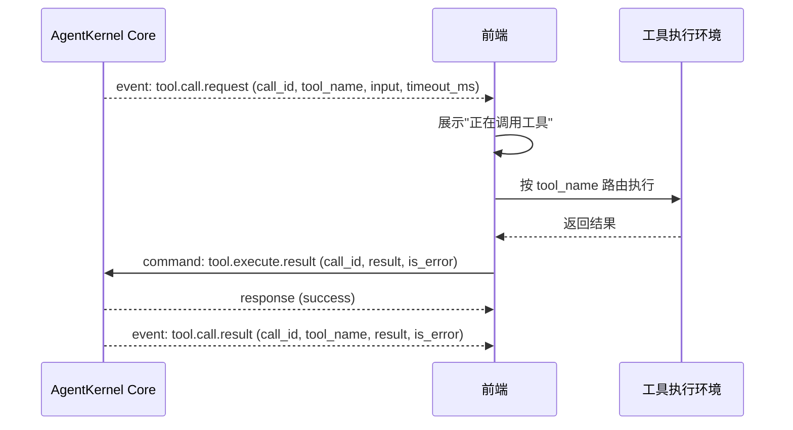
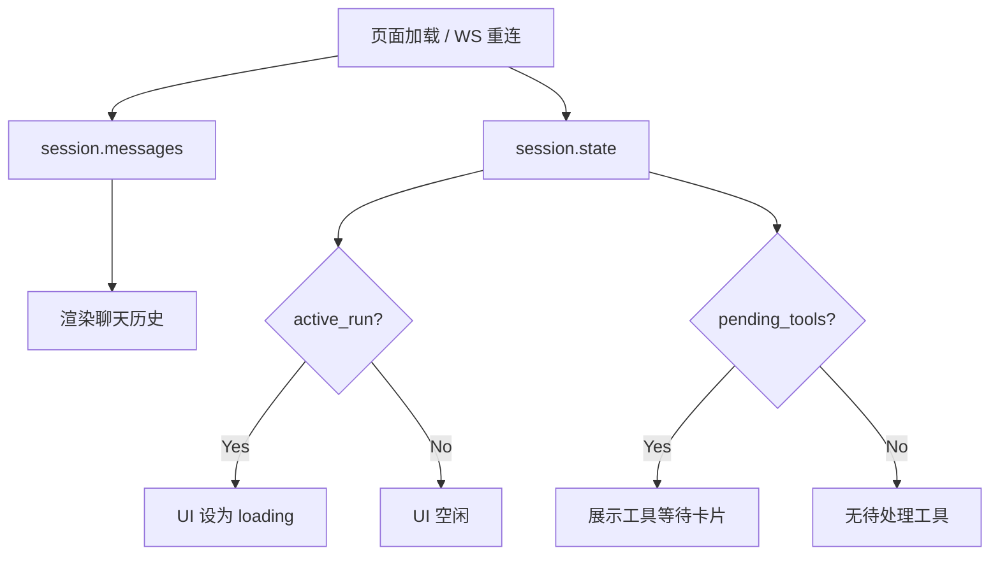
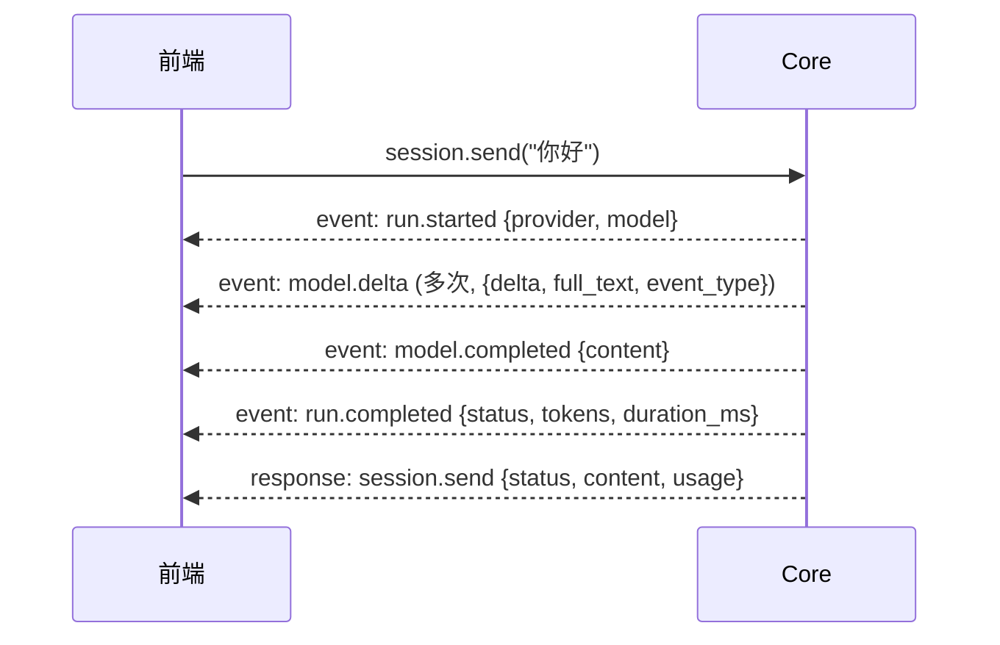
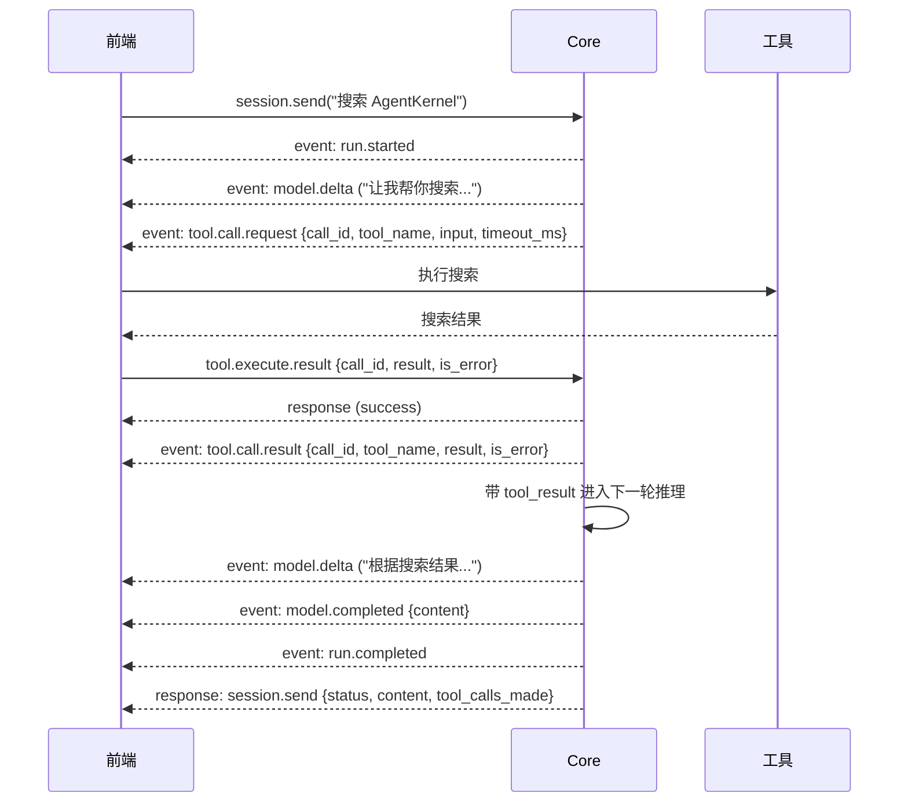
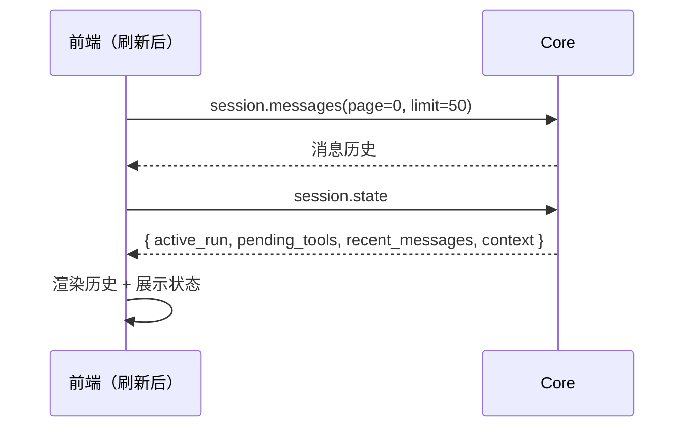
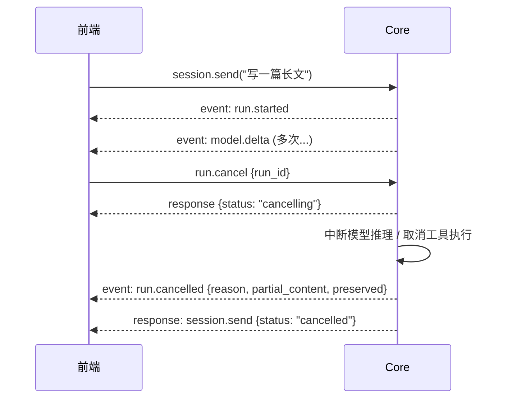

# AgentKernel 前端完整接入指南

> **版本**: v2.0.0 | **最后更新**: 2026-06-15
> 面向前端开发者的完整接入参考。所有命令参数、事件字段、类型定义均从 Rust 源码提取，可作为权威参考。

---

## 目录

1. [连接与协议](#1-连接与协议)
2. [核心类型定义](#2-核心类型定义)
3. [会话管理](#3-会话管理)
4. [发送消息与接收回复](#4-发送消息与接收回复)
5. [事件系统](#5-事件系统)
6. [工具调用](#6-工具调用)
7. [供应商配置](#7-供应商配置)
8. [系统提示词](#8-系统提示词)
9. [上下文窗口管理](#9-上下文窗口管理)
10. [页面刷新与状态恢复](#10-页面刷新与状态恢复)
11. [多前端协作](#11-多前端协作)
12. [完整示例：一个对话的全生命周期](#12-完整示例一个对话的全生命周期)
13. [附录：命令速查表](#13-附录命令速查表)

---

## 1. 连接与协议

### 1.1 连接

```
ws://localhost:9991/ws          (本地开发)
wss://agentkernel.fly.dev/ws    (线上)
```

连接建立后，服务端立即推送 Hello 响应（无需客户端请求）：

```javascript
const ws = new WebSocket('ws://localhost:9991/ws');

ws.onopen = () => { /* 连接建立 */ };

ws.onmessage = (e) => {
  const msg = JSON.parse(e.data);
  switch (msg.type) {
    case 'response': handleResponse(msg); break;
    case 'event':    handleEvent(msg);    break;
    case 'stream':   handleStream(msg);   break;  // 心跳
  }
};
```

### 1.2 消息格式

所有消息均为 JSON 文本帧。

**Command（前端 → Core）**：
```typescript
interface Command {
  command: string;        // 命令名，如 "session.send"
  request_id: string;     // 唯一请求 ID，前端生成，用于匹配 response
  session_id: string;     // 会话 ID（顶层字段，不在 payload 内）。部分命令可为空
  payload: object;        // 命令参数，见各命令定义
}
```

**Response（Core → 前端）**：
```typescript
interface Response {
  type: "response";
  request_id: string;     // 对应请求的 ID
  success: boolean;       // 是否成功
  payload: object;        // 响应数据，见各命令定义
}
```

**Event（Core → 前端）**：
```typescript
interface Event {
  type: "event";
  event_type: string;     // 事件名，如 "model.delta"
  session_id: string;     // 会话 ID
  run_id: string;         // run ID（部分事件可能为空）
  trace_id: string;       // 链路追踪 ID
  timestamp: string;      // ISO 8601 时间戳
  event_seq?: number;     // 事件序列号（session 内单调递增，用于断线补拉）
  payload: object;        // 事件数据，见各事件定义
}
```

**Stream（Core → 前端）**：心跳 `{"type":"stream","event":"ping"}`，回复 `{"type":"stream","event":"pong"}`。

### 1.3 关联 ID

| ID | 作用域 | 类型 | 说明 |
|----|--------|------|------|
| `session_id` | 会话级 | `string` | 所有消息和事件属于某个 session |
| `run_id` | 单次对话执行 | `string` | 格式 `run_{uuid}`，从 `session.send` 到 `run.completed`，一次 run 可包含多轮工具调用 |
| `request_id` | 单条命令 | `string` | 前端生成，用于匹配 response |
| `call_id` | 单次工具调用 | `string` | 配对 `tool.call.request` 和 `tool.execute.result` |
| `event_seq` | Session 内事件序号 | `number` | 单调递增，用于断线补拉 |
| `connection_id` | 连接级 | `string` | Hello 响应中返回，标识本次 WS 连接 |
| `message_id` | 消息级 | `string` | 格式 `msg_{uuid}`，唯一标识一条消息 |
| `seed_id` | Seed 级 | `string` | 格式 `seed_{uuid}`，唯一标识一个上下文种子 |

---

## 2. 核心类型定义

### 2.1 Role（消息角色）

```typescript
type Role = "user" | "assistant" | "system" | "tool";
```

### 2.2 MessageKind（消息类型）

```typescript
type MessageKind = "normal" | "tool_result" | "compaction_summary" | "context_seed" | "system_note";
```

### 2.3 ContentBlock（内容块）

消息内容由多个 ContentBlock 组成，`type` 字段区分类型：

```typescript
// 文本块
interface TextBlock {
  type: "text";
  text: string;
  reasoning_content?: string;  // 推理内容（部分模型支持）
}

// 图片块
interface ImageBlock {
  type: "image";
  source: {
    type: "base64";           // 固定值
    media_type: string;       // 如 "image/png", "image/jpeg"
    data: string;             // base64 编码的图片数据
  };
}

// 工具调用块（模型请求执行工具）
interface ToolUseBlock {
  type: "tool_use";
  id: string;                 // call_id，格式 call_{uuid}
  name: string;               // 工具名称
  input: object;              // 工具输入参数
}

// 工具结果块（前端回传工具执行结果）
interface ToolResultBlock {
  type: "tool_result";
  tool_use_id: string;        // 对应 ToolUseBlock 的 id
  content?: string;           // 工具执行结果（字符串）
  is_error?: boolean;         // 是否为错误结果
}

// 思考块（Claude Extended Thinking）
interface ThinkingBlock {
  type: "thinking";
  thinking: string;           // 思考内容
  signature?: string;         // 签名（Claude 协议要求回传）
}

// 音频块
interface AudioBlock {
  type: "audio";
  source: {
    data: string;             // base64 编码的音频数据
    format: string;           // 如 "wav", "mp3"
  };
}
```

### 2.4 Protocol（协议类型）

```typescript
type Protocol = "openai" | "claude";
```

### 2.5 ToolsMode（工具模式）

```typescript
type ToolsMode = "standard" | "text_match";
// standard: 使用 OpenAI/Claude 原生 function calling
// text_match: 文本匹配模式（兼容不支持 function calling 的模型）
```

### 2.6 StopReason（停止原因）

```typescript
type StopReason = "end_turn" | "tool_use" | "max_tokens" | "stop_sequence" | "unknown";
```

### 2.7 TrimMode（裁剪模式）

```typescript
type TrimMode = "none" | "keep_recent_messages" | "include_after" | "checkpoint";
```

### 2.8 ContextMode（上下文模式）

```typescript
type ContextMode = "full" | "sliding" | "compacted";
```

### 2.9 SeedKind（种子类型）

```typescript
type SeedKind = "system_memory" | "compaction_summary" | "user_preference" | "world_state" | "agent_state";
```

---

## 3. 会话管理

### 3.1 `session.get` — 获取 Session 统计

**session_id**: 必填

**payload**: `{}` （无参数）

**Response**:
```typescript
{
  session_id: string;
  message_count: number;        // 消息总数
  estimated_tokens: number;     // 估算 token 数
  window_tokens: number;        // 上下文窗口大小
  usage_percent: number;        // 使用百分比
}
```

### 3.2 `session.info` — 获取 Session 完整详情

**session_id**: 必填

**payload**: `{}` （无参数）

**Response**:
```typescript
{
  session_id: string;
  session: {
    session_id: string;
    type: string;               // "normal" | "archived" 等
    title: string;
    status: string;             // "active" | "closed" | "archived"
    created_at: string;         // ISO 8601
    updated_at: string;         // ISO 8601
  } | null;
  context: {
    message_count: number;
    seed_count: number;
    estimated_tokens: number;
    window_tokens: number;
    usage_percent: number;
  };
  provider_override: boolean;   // 是否有 session 级供应商覆盖
  system_prompt_override: boolean; // 是否有 session 级系统提示词覆盖
  tool_count: number;           // 已注册工具数量
}
```

### 3.3 `session.list` — 分页查询 Session 列表

**session_id**: 空（系统级命令）

**payload**:
```typescript
{
  page?: number;    // 页码，从 0 开始，默认 0
  limit?: number;   // 每页数量，默认 20，最大 100
  status?: string;  // 过滤状态："active"（默认）| "paused" | "closed" | "archived"
}
```

**Response**:
```typescript
{
  page: number;
  limit: number;
  total: number;                // 总数
  pages: number;                // 总页数
  sessions: Array<{
    session_id: string;
    type: string;
    title: string;
    status: string;
    message_count: number;
    estimated_tokens: number;
    provider_override: boolean;
    system_prompt_override: boolean;
    created_at: string;         // ISO 8601
    updated_at: string;         // ISO 8601
    summary: string;            // session 摘要（如有）
  }>;
}
```

### 3.4 `session.messages` — 分页读取消息历史

**session_id**: 必填

**payload**:
```typescript
{
  page?: number;      // 页码，从 0 开始，默认 0
  limit?: number;     // 每页数量，默认 50，最大 200
  order?: string;     // 排序方向："asc"（默认，从旧到新）| "desc"（从新到旧）
}
```

**Response**:
```typescript
{
  session_id: string;
  page: number;
  limit: number;
  order: string;
  total: number;                // 消息总数
  pages: number;                // 总页数
  messages: Array<{
    message_id: string;         // msg_{uuid}
    session_id: string;
    run_id: string;             // 所属 run，可能为空
    role: string;               // "user" | "assistant" | "system" | "tool"
    kind: string;               // "normal" | "tool_result" | "compaction_summary" | ...
    text: string;               // 纯文本摘要（从 content 块中提取）
    content: ContentBlock[];    // 完整内容块数组
    created_at: string;         // ISO 8601
  }>;
}
```

### 3.5 `session.state` — 获取 Session 状态快照

**session_id**: 必填

**payload**: `{}` （无参数）

**Response**:
```typescript
{
  session_id: string;
  active_run: {                 // 当前活跃 run，null 表示无活跃 run
    run_id: string;
    status: string;             // "running" | "streaming" | "pending" | "cancelling"
    duration_ms: number;        // 已运行时长（毫秒）
  } | null;
  pending_tools: Array<{        // 等待执行的工具调用
    call_id: string;
    tool_name: string;
  }>;
  recent_messages: Array<{      // 最近 30 条消息
    message_id: string;
    role: string;
    kind: string;
    run_id: string;
    has_tool_use: boolean;      // 是否包含工具调用
    has_tool_result: boolean;   // 是否包含工具结果
    text: string;
    content: ContentBlock[];
    created_at: string;
  }>;
  context: {
    message_count: number;
    estimated_tokens: number;
    window_tokens: number;
    usage_percent: number;
  };
  seed_count: number;           // 上下文种子数量
}
```

### 3.6 `session.fork` — 分叉会话

**session_id**: 空（源/目标在 payload 中指定）

**payload**:
```typescript
{
  source_session_id: string;    // 必填，源 session ID
  new_session_id: string;       // 必填，目标 session ID（不能已存在）
}
```

**Response**:
```typescript
{
  source_session_id: string;
  new_session_id: string;
  session: object;              // 新 session 元数据
  forked: boolean;              // true
}
```

### 3.7 `session.close` — 关闭会话

**session_id**: 必填

**payload**: `{}` （无参数）

**Response**:
```typescript
{
  session_id: string;
  closed: boolean;
  unloaded: boolean;            // 是否从内存卸载
  note: string;                 // "session history preserved in storage"
}
```

### 3.8 `session.archive` — 归档会话

**session_id**: 必填

**payload**: `{}` （无参数）

**Response**:
```typescript
{
  session_id: string;
  archived: boolean;
  session: object;              // session 元数据
}
```

### 3.9 `session.unarchive` — 恢复归档会话

**session_id**: 必填

**payload**: `{}` （无参数）

**Response**:
```typescript
{
  session_id: string;
  unarchived: boolean;
  session: object;              // session 元数据
}
```

### 3.10 `session.delete` — 永久删除会话

**session_id**: 必填

**payload**:
```typescript
{
  permanent: boolean;           // 必须为 true，否则拒绝执行
}
```

**Response**:
```typescript
{
  session_id: string;
  deleted: boolean;
  permanent: true;
}
```

### 3.11 `session.message.insert` — 插入消息（不触发推理）

**session_id**: 必填

**payload**:
```typescript
{
  role: string;                 // 必填，"user" | "assistant"
  content: string;              // 必填，消息文本内容
}
```

**Response**:
```typescript
{
  message_id: string;           // 新插入消息的 ID
  session_id: string;
  role: string;
}
```

---

## 4. 发送消息与接收回复

### 4.1 `session.send` — 发送消息触发推理

**session_id**: 必填

**payload**:
```typescript
{
  message: string;                    // 必填（除非有 images 或 audio），用户文本
  images?: string[];                  // 可选，base64 编码的图片数组
  audio?: Array<{                     // 可选，音频数组
    data: string;                     //   base64 编码的音频数据
    format: string;                   //   音频格式，如 "wav", "mp3"
  }>;
  max_repeated_tool_calls?: number;   // 可选，同参数连续调用上限，默认 10
}
```

**并发限制**：同一 session 同时只能有一个活跃 run。尝试并发 send 会返回错误。

**Response 时机**：`session.send` 的 response 在 run 全部结束后才返回（包括所有工具调用轮次）。run 过程中的状态变化通过 event 推送。

**Response**:
```typescript
{
  session_id: string;
  run_id: string;             // 本次 run 的 ID
  status: string;             // "completed" | "cancelled" | "failed"
  partial_preserved: boolean; // 是否保留了中断前的部分输出
  content: string;            // 模型最终输出文本
  usage: {
    input_tokens: number;
    output_tokens: number;
  };
  traces: number;             // provider 调用 trace 数量
  tool_calls_made: number;    // 工具调用总次数
}
```

### 4.2 `session.retry` — 重试上一轮

重试上一轮，不追加新消息。用于模型空响应或工具链中断后的续跑。

**session_id**: 必填

**payload**:
```typescript
{
  max_repeated_tool_calls?: number;   // 可选，同参数连续调用上限，默认 10
}
```

**Response**:
```typescript
{
  session_id: string;
  run_id: string;
  status: string;
  retried: true;
  partial_preserved: boolean;
  content: string;
  usage: {
    input_tokens: number;
    output_tokens: number;
  };
  traces: number;
  tool_calls_made: number;
}
```

### 4.3 `run.cancel` — 中断正在进行的 run

**session_id**: 必填

**payload**:
```typescript
{
  run_id: string;             // 必填，要取消的 run ID
}
```

**Response**:
```typescript
{
  status: string;             // "cancelling" | "not_found"
  session_id: string;
  run_id: string;
  cancelled: boolean;         // 是否成功取消
}
```

> Response 只表示"已收到请求"。真正完成以 `run.cancelled` 事件为准。

---

## 5. 事件系统

### 5.1 事件总表

| 事件 | 说明 | payload 关键字段 |
|------|------|-----------------|
| `run.started` | run 开始 | `provider`, `model` |
| `run.retrying` | Core 内部重试 | `source`, `attempt`, `delay_ms`, `reason` |
| `model.delta` | 流式文本增量 | `delta`, `full_text`, `event_type` |
| `model.completed` | 模型输出完成 | `content` |
| `run.completed` | run 结束 | `status`, `input_tokens`, `output_tokens`, `total_tokens`, `tool_calls_made`, `duration_ms` |
| `run.failed` | run 失败 | `source`, `stage`, `retryable`, `message` |
| `run.cancelled` | run 被取消 | `reason`, `partial_content`, `preserved`, `duration_ms` |
| `tool.call.request` | 请求执行工具 | `call_id`, `tool_name`, `input`, `timeout_ms` |
| `tool.call.result` | 工具结果已回填 | `call_id`, `tool_name`, `result`, `is_error` |
| `tool.registered` | 工具注册完成 | `tool_name`, `client_id`, `session_id` |
| `tool_chain.diagnosed` | 工具链诊断 | `report`（含完整诊断对象） |
| `checkpoint.applied` | 上下文自动裁剪 | `message_count`, `estimated_tokens`, `window_tokens` |
| `context.updated` | 上下文配置变更 | `action`, `context` |
| `context.seed.added` | Seed 新增 | `seed` |
| `context.seed.updated` | Seed 更新 | `seed` |
| `context.seed.deleted` | Seed 删除 | `seed_id` |
| `context.seed.cleared` | Seed 清空 | `kind`, `removed_count` |
| `session.created` | Session 创建 | - |
| `session.closed` | Session 关闭 | - |
| `session.archived` | Session 归档 | - |
| `session.unarchived` | Session 恢复归档 | - |
| `session.deleted` | Session 删除 | - |
| `prompt.attached` | 系统提示词附加 | - |

### 5.2 核心事件 payload 详解

**`run.started`**:
```json
{
  "provider": "openai",       // Protocol 类型："openai" | "claude"
  "model": "deepseek-chat"    // 模型名称
}
```

**`model.delta`**（流式增量，**用 `full_text` 覆盖渲染，不要用 `delta` 拼接**）:
```json
{
  "delta": "今天北京",           // 本次增量文本
  "full_text": "今天北京天气晴朗，", // 累积完整文本（如有）
  "event_type": "text"           // "text" | "thinking"
}
```

> **重要**：`full_text` 字段不一定由所有后端实现提供。如果 `full_text` 存在，用它覆盖渲染；如果不存在，用 `delta` 逐次拼接到累积变量。

**`model.completed`**:
```json
{
  "content": "今天北京天气晴朗，气温25°C..."  // 模型最终完整输出文本
}
```

**`run.completed`**:
```json
{
  "status": "completed",
  "input_tokens": 1200,
  "output_tokens": 350,
  "total_tokens": 1550,
  "tool_calls_made": 1,
  "duration_ms": 3200
}
```

**`run.failed`**:
```json
{
  "source": "provider",         // "provider" | "core"
  "stage": "model.stream",      // 失败阶段
  "retryable": false,           // 是否可重试
  "message": "API rate limit"   // 错误描述
}
```

**`run.cancelled`**:
```json
{
  "reason": "user_cancelled",
  "partial_content": "已完成的部分输出...",
  "preserved": true,            // 是否保留了中断前的输出
  "duration_ms": 1500
}
```

**`run.retrying`**:
```json
{
  "source": "provider",
  "attempt": 1,                 // 第几次重试
  "delay_ms": 1000,             // 重试延迟
  "reason": "connection timeout"
}
```

**`tool.call.request`**:
```json
{
  "call_id": "call_001",        // 工具调用 ID，回传结果时需要
  "tool_name": "web_search",
  "input": { "query": "AgentKernel" },
  "timeout_ms": 30000           // 超时时间（毫秒），0 表示不超时
}
```

**`tool.call.result`**:
```json
{
  "call_id": "call_001",
  "tool_name": "web_search",
  "result": "搜索结果...",
  "is_error": false
}
```

**`checkpoint.applied`**:
```json
{
  "message_count": 35,
  "estimated_tokens": 180000,
  "window_tokens": 200000
}
```

### 5.3 事件订阅

当前推荐按"连接维度的 session 集合"订阅实时事件。

- 测试页或简单客户端：可继续在连接建立后，对当前选中的 `session_id` 调用一次 `events.subscribe`
- 业务后端聚合上游：应把所有当前活跃页面关注的 `session_id` 聚合成 `session_ids` 数组，一次发送给 AgentKernel
- 服务端会按 `mode=replace` 处理：同一条 WS 连接上的新订阅集合会覆盖旧集合，并自动清理残留订阅

单 session 兼容调用：

```json
{ "command": "events.subscribe", "request_id": "r_sub", "session_id": "my_session", "payload": { "since_seq": 0 } }
```

批量订阅调用：

```json
{
  "command": "events.subscribe",
  "request_id": "r_sub_batch",
  "session_id": "",
  "payload": {
    "session_ids": ["session_1", "session_2"],
    "mode": "replace",
    "since_seq": 0
  }
}
```

这样做后，该连接会实时收到订阅集合里所有 session 的事件，包括其他页面发起的 `session.send` / `session.retry`。

### 5.4 `events.subscribe` — 订阅实时事件

**session_id**: 兼容单 session 用法时必填  
**payload.session_ids**: 推荐的批量订阅用法

**payload**:
```typescript
{
  session_ids?: string[];       // 推荐：一次订阅多个 session
  mode?: "replace";             // 当前仅支持 replace，表示用新集合替换旧集合
  since_seq?: number;           // 可选，从哪个序列号开始补拉，默认 0（不补拉）
}
```

**Response**:
```typescript
{
  session_id: string;           // 单 session 时返回；批量时可能为空字符串
  session_ids: string[];        // 当前生效的订阅集合
  subscribed: boolean;
  already_subscribed: boolean;  // 订阅集合是否与当前现有集合完全一致
  mode: "replace";              // 用新订阅集合替换旧集合
  replaced_session_ids: string[]; // 本次订阅覆盖掉的旧 session 订阅
  since_seq: number;
  current_seq: number | Record<string, number>; // 单 session 为 number，批量时为映射
  current_seq_by_session: Record<string, number>;
  replayed: number | Record<string, number>;    // 单 session 为 number，批量时为映射
  replayed_by_session: Record<string, number>;
}
```

### 5.5 `events.unsubscribe` — 取消事件订阅

**session_id**: 单 session 取消订阅时可用  
**payload.session_ids**: 批量取消指定 session 订阅  
**payload.clear_all**: 清空当前连接上的全部订阅

**payload**:
```typescript
{
  session_ids?: string[];
  clear_all?: boolean;
}
```

**Response**:
```typescript
{
  session_id: string;
  session_ids: string[];
  unsubscribed: boolean;
  was_subscribed: boolean;      // 取消前是否已订阅
  removed_session_ids?: string[];
  clear_all?: boolean;
}
```

### 5.6 `events.pull` — 断线补拉

**session_id**: 必填

**payload**:
```typescript
{
  since_seq?: number;           // 可选，从哪个序列号开始拉取，默认 0
}
```

**Response**:
```typescript
{
  session_id: string;
  since_seq: number;
  current_seq: number;
  count: number;                // 返回的事件数量
  events: Event[];              // 事件数组
}
```

---

## 6. 工具调用

### 6.1 `tool.register` — 注册工具

**session_id**: 必填

**payload**:
```typescript
{
  tool_name: string;            // 必填，工具名称（唯一标识）
  description: string;          // 可选，工具描述
  schema?: {                    // 可选，JSON Schema 定义输入参数
    type: "object";
    properties: Record<string, {
      type: string;             // "string" | "number" | "boolean" | "object" | "array"
      description?: string;
      enum?: string[];          // 枚举值
    }>;
    required?: string[];        // 必填字段列表
  };
  client_id?: string;           // 可选，客户端标识，默认 "unknown"
  permissions?: string[];       // 可选，权限列表
  timeout_ms?: number;          // 可选，超时时间（毫秒），默认 0（不超时）
  tags?: string[];              // 可选，标签列表
}
```

**Response**:
```typescript
{
  registered: string;           // 工具名称
  session_id: string;
}
```

### 6.2 `tool.unregister` — 注销工具

**session_id**: 可选（如果提供则同时清理 session 快照）

**payload**:
```typescript
{
  tool_name: string;            // 必填，要注销的工具名称
}
```

**Response**:
```typescript
{
  unregistered: string;         // 工具名称
  session_id: string;
}
```

### 6.3 `tool.list` — 查询已注册工具

**session_id**: 必填

**payload**: `{}` （无参数）

**Response**:
```typescript
{
  session_id: string;
  count: number;
  tools: Array<{
    name: string;
    description: string;
    client_id: string;
    timeout_ms: number;
    tags: string[];
  }>;
}
```

### 6.4 `tool.get` — 获取工具详情

**session_id**: 必填

**payload**:
```typescript
{
  tool_name: string;            // 必填，工具名称
}
```

**Response**:
```typescript
{
  tool: {
    name: string;
    description: string;
    input_schema: object;       // JSON Schema
    compiled_schemas: Record<string, object>; // 按协议编译后的 schema
  };
  registration: {
    tool_name: string;
    description: string;
    client_id: string;
    permissions: string[];
    timeout_ms: number;
    tags: string[];
  } | null;
}
```

### 6.5 `tool.execute.result` — 回传工具执行结果

**session_id**: 必填

**payload**:
```typescript
{
  call_id: string;              // 必填，与 tool.call.request 中的 call_id 一致
  result: string;               // 必填，工具执行结果（**必须是字符串**，结构化数据请 JSON.stringify）
  is_error?: boolean;           // 可选，默认 false
}
```

**Response**: Core 返回 success response 确认收到。

### 6.6 工具调用生命周期



### 6.7 多工具并行

模型可能在一次输出中请求多个工具。Core 为每个 tool_use 发射独立的 `tool.call.request`，前端并发处理，逐个回传 `tool.execute.result`。Core 全部收齐后合并进入下一轮推理。

### 6.8 工具调用去重

以 `call_id` 为 key 做去重：同一 `call_id` 已执行或已回传的 `tool.call.request` 应忽略。

---

## 7. 供应商配置

### 7.1 `provider.update` — 更新 Session 级供应商配置

**session_id**: 必填

**payload**（所有字段可选，只传需要修改的字段）:
```typescript
{
  protocol?: string;            // "openai" | "claude"
  base_url?: string;            // API 基础 URL
  api_key?: string;             // API Key（更新后不可为空）
  model?: string;               // 模型名称（更新后不可为空）
  max_tokens?: number;          // 最大输出 token 数，默认 4096
  temperature?: number;         // 温度参数，默认 0
  supports_image?: boolean;     // 是否支持图片输入，默认 false
  supports_audio?: boolean;     // 是否支持音频输入，默认 false
}
```

> **验证规则**：`api_key` 和 `model` 在更新后不能为空。

**Response**:
```typescript
{
  session_id: string;
  provider: {
    protocol: string;
    base_url: string;
    model: string;
    max_tokens: number;
    temperature: number;
    supports_image: boolean;
    supports_audio: boolean;
  };
}
```

### 7.2 `provider.get` — 读取供应商配置

**session_id**: 可选（空则读取全局默认配置）

**payload**: `{}` （无参数）

**Response**:
```typescript
{
  session_id: string;
  is_override: boolean;         // 是否有 session 级覆盖
  provider: {
    protocol: string;
    base_url: string;
    api_key: string;            // 注意：会返回完整 API Key
    model: string;
    max_tokens: number;
    temperature: number;
    supports_image: boolean;
    supports_audio: boolean;
  };
}
```

---

## 8. 系统提示词

### 8.1 `system_prompt.set` — 设置系统提示词

**session_id**: 可选（空则设置全局默认提示词，非空则设置 session 级覆盖）

**payload**:
```typescript
{
  system_prompt: string;        // 必填，系统提示词内容
}
```

**Response**:
```typescript
{
  session_id: string;
  system_prompt: string;        // 设置后的完整提示词
  is_session_override: boolean; // 是否为 session 级覆盖
  updated: true;
}
```

### 8.2 `system_prompt.get` — 读取系统提示词

**session_id**: 可选（空则读取全局默认提示词）

**payload**: `{}` （无参数）

**Response**:
```typescript
{
  session_id: string;
  system_prompt: string;        // 当前生效的系统提示词
  is_session_override: boolean; // 是否为 session 级覆盖
}
```

---

## 9. 上下文窗口管理

### 9.1 `context.preview` — 预览上下文

**session_id**: 必填

**payload**: `{}` （无参数）

**Response**:
```typescript
{
  session_id: string;
  active_context: {
    context_id: string;
    mode: string;               // "full" | "sliding" | "compacted"
    rules: {
      exclude_ranges: [string, string][];
      trim: TrimPolicy;
      base_seed_ids: string[];
    };
    created_at: string;
  };
  stats: {
    message_count: number;
    estimated_tokens: number;
    window_tokens: number;
    usage_percent: number;
  };
  counts: {
    all_messages: number;       // 全部消息数
    active_messages: number;    // 当前可见消息数
    model_input_messages: number; // 实际发送给模型的消息数
    seeds: number;              // 种子数量
  };
  messages: Message[];          // 当前可见消息数组
  seeds: ContextSeed[];         // 种子数组
  preview: string;              // 预览文本
}
```

### 9.2 `context.trim.set` — 设置裁剪策略

**session_id**: 必填

**payload**（根据 `mode` 不同，需要不同的必填字段）:

```typescript
// 模式 1: 不裁剪
{ mode: "none" }

// 模式 2: 只保留最近 N 条消息
{
  mode: "keep_recent_messages",
  keep_messages: number         // 必填，> 0
}

// 模式 3: 从指定消息之后开始
{
  mode: "include_after",
  message_id: string            // 必填，消息 ID
}

// 模式 4: 自动阶梯裁剪（按消息数触发，按轮次保留）
{
  mode: "checkpoint",
  trigger_max_context_messages: number,  // 必填，触发裁剪的消息数阈值，> 0
  retain_recent_turns: number            // 必填，保留的最近对话轮数，> 0
}
```

**Response**:
```typescript
{
  session_id: string;
  active_context: ContextState; // 更新后的上下文状态
}
```

### 9.3 `context.exclude` — 排除消息区间

**session_id**: 必填

**payload**:
```typescript
{
  start_message_id: string;     // 必填，起始消息 ID
  end_message_id?: string;      // 可选，结束消息 ID（默认等于 start_message_id）
}
```

**Response**:
```typescript
{
  session_id: string;
  active_context: ContextState;
}
```

### 9.4 `context.seed.add` — 新增 Seed

**session_id**: 必填

**payload**:
```typescript
{
  content: string;              // 必填，种子内容
  kind?: string;                // 可选，种子类型，默认 "system_memory"
                                // "system_memory" | "compaction_summary" | "user_preference" | "world_state" | "agent_state"
  enabled?: boolean;            // 可选，是否启用，默认 true
  priority?: number;            // 可选，优先级（整数），默认 0，数值越大越靠前
}
```

**Response**:
```typescript
{
  session_id: string;
  seed: {
    seed_id: string;            // 自动生成的 seed ID
    session_id: string;
    kind: string;
    content: string;
    enabled: boolean;
    priority: number;
  };
}
```

### 9.5 `context.seed.set` — 按类型覆盖写入 Seed

删除同 `kind` 的旧 seed 后写入新 seed。适合"压缩摘要"等场景。

**session_id**: 必填

**payload**:
```typescript
{
  content: string;              // 必填，种子内容
  kind?: string;                // 可选，种子类型，默认 "system_memory"
  enabled?: boolean;            // 可选，是否启用，默认 true
  priority?: number;            // 可选，优先级，默认 0
  seed_id?: string;             // 可选，指定 seed ID（为空则自动生成）
}
```

**Response**:
```typescript
{
  session_id: string;
  seed: ContextSeed;
}
```

### 9.6 `context.seed.delete` — 删除指定 Seed

**session_id**: 必填

**payload**:
```typescript
{
  seed_id: string;              // 必填，要删除的 seed ID
}
```

**Response**:
```typescript
{
  session_id: string;
  seed_id: string;
  removed: ContextSeed;         // 被删除的 seed
}
```

### 9.7 `context.seed.clear` — 清空 Seeds

**session_id**: 必填

**payload**:
```typescript
{
  kind?: string;                // 可选，按类型过滤。为空则清空全部
}
```

**Response**:
```typescript
{
  session_id: string;
  kind: string | null;
  removed: ContextSeed[];       // 被删除的 seed 数组
}
```

---

## 10. 页面刷新与状态恢复

### 10.1 推荐恢复流程



**推荐调用顺序**：
```
1. session.messages(page=0, limit=50)   恢复聊天历史
2. session.state                         恢复 run 状态 + pending tools
```

### 10.2 pending_tools 判断

`pending_tools` = 消息历史中有 `tool_use` 但没有对应 `tool_result` 的工具调用。

- `active_run` 存在且 status 为 `running` → 工具仍在等待中
- `active_run` 不存在或已结束 → run 中断了，pending 工具不会再被请求

### 10.3 `runtime.sessions` — 查询运行中的 Session

**session_id**: 空（系统级命令）

**payload**: `{}` （无参数）

**Response**:
```typescript
{
  running_session_count: number;
  running_run_count: number;
  sessions: string[];           // 运行中的 session ID 列表
  runs: Array<{
    session_id: string;
    run_id: string;
    status: string;
    duration_ms: number;
  }>;
}
```

### 10.4 `system.stats` — 系统级统计

**session_id**: 空（系统级命令）

**payload**: `{}` （无参数）

**Response**:
```typescript
{
  session_count: number;
  tool_count: number;
  default_provider: {
    protocol: string;
    base_url: string;
    model: string;
    context_window_tokens: number;
  };
  system_prompt_length: number; // 系统提示词字符数
}
```

---

## 11. 多前端协作

### 11.1 问题

默认情况下，`session.send` 创建的事件转发器只推给发起连接。其他连接收不到同一 session 的事件。

### 11.2 方案：`events.subscribe`

前端 B 想观察前端 A 对同一 session 的操作：

```json
{ "command": "events.subscribe", "request_id": "r_sub", "session_id": "my_session", "payload": { "since_seq": 0 } }
```

### 11.3 当前推荐实现

- 每个页面连接建立后，自动订阅当前选中的 `session`
- 页面切换到其他会话时，再发送一次 `events.subscribe`
- 服务端会自动覆盖旧订阅，因此同一 WS 连接不会留下僵尸订阅
- 如果当前连接已经对该 session 建立了 session 级订阅，服务端会抑制同 session 的 run 级临时转发，避免同一页面收到重复事件

---

## 12. 完整示例：一个对话的全生命周期

### 12.1 简单对话（无工具调用）



### 12.2 带工具调用的对话



### 12.3 刷新后恢复



### 12.4 取消正在进行的 run



---

## 13. 附录：命令速查表

### 前端 → Core

| 命令 | 作用 | session_id | 关键 payload 字段 |
|------|------|-----------|------------------|
| `session.send` | 发送消息，触发推理 | 必填 | `message`, `images?`, `audio?`, `max_repeated_tool_calls?` |
| `session.retry` | 重试上一轮 | 必填 | `max_repeated_tool_calls?` |
| `session.message.insert` | 插入消息（不推理） | 必填 | `role`, `content` |
| `session.get` | 获取统计 | 必填 | — |
| `session.info` | 获取详情 | 必填 | — |
| `session.messages` | 读取消息历史 | 必填 | `page?`, `limit?`, `order?` |
| `session.list` | 会话列表 | 空 | `page?`, `limit?`, `status?` |
| `session.state` | 状态快照 | 必填 | — |
| `session.fork` | 分叉会话 | 空 | `source_session_id`, `new_session_id` |
| `session.close` | 关闭会话 | 必填 | — |
| `session.archive` | 归档 | 必填 | — |
| `session.unarchive` | 恢复归档 | 必填 | — |
| `session.delete` | 永久删除 | 必填 | `permanent`（必须为 true） |
| `run.cancel` | 中断 run | 必填 | `run_id` |
| `tool.register` | 注册工具 | 必填 | `tool_name`, `description?`, `schema?`, `client_id?`, `timeout_ms?`, `tags?` |
| `tool.unregister` | 注销工具 | 可选 | `tool_name` |
| `tool.list` | 工具列表 | 必填 | — |
| `tool.get` | 工具详情 | 必填 | `tool_name` |
| `tool.execute.result` | 回传工具结果 | 必填 | `call_id`, `result`, `is_error?` |
| `provider.update` | 更新供应商配置 | 必填 | `protocol?`, `base_url?`, `api_key?`, `model?`, `max_tokens?`, `temperature?`, `supports_image?`, `supports_audio?` |
| `provider.get` | 读取供应商配置 | 可选 | — |
| `system_prompt.set` | 设置系统提示词 | 可选 | `system_prompt` |
| `system_prompt.get` | 读取系统提示词 | 可选 | — |
| `context.preview` | 预览上下文 | 必填 | — |
| `context.trim.set` | 设置裁剪策略 | 必填 | `mode`, + 模式相关字段 |
| `context.exclude` | 排除消息区间 | 必填 | `start_message_id`, `end_message_id?` |
| `context.seed.add` | 新增 Seed | 必填 | `content`, `kind?`, `enabled?`, `priority?` |
| `context.seed.set` | 覆盖写入 Seed | 必填 | `content`, `kind?`, `enabled?`, `priority?`, `seed_id?` |
| `context.seed.delete` | 删除 Seed | 必填 | `seed_id` |
| `context.seed.clear` | 清空 Seeds | 必填 | `kind?` |
| `events.subscribe` | 以单连接覆盖模式订阅当前 session 实时事件 | 必填 | `since_seq?` |
| `events.unsubscribe` | 取消订阅 | 必填 | — |
| `events.pull` | 断线补拉 | 必填 | `since_seq?` |
| `runtime.sessions` | 运行中的 session | 空 | — |
| `system.stats` | 系统统计 | 空 | — |

### Core → 前端（事件）

| 事件 | payload 关键字段 |
|------|-----------------|
| `message.added` | `message_id`, `role`, `content` |
| `run.started` | `provider`, `model` |
| `model.delta` | `delta`, `full_text?`, `event_type` |
| `model.completed` | `content` |
| `run.completed` | `status`, `input_tokens`, `output_tokens`, `total_tokens`, `tool_calls_made`, `duration_ms` |
| `run.failed` | `source`, `stage`, `retryable`, `message` |
| `run.cancelled` | `reason`, `partial_content`, `preserved`, `duration_ms` |
| `run.retrying` | `source`, `attempt`, `delay_ms`, `reason` |
| `tool.call.request` | `call_id`, `tool_name`, `input`, `timeout_ms` |
| `tool.call.result` | `call_id`, `tool_name`, `result`, `is_error` |
| `tool.registered` | `tool_name`, `client_id`, `session_id` |
| `tool_chain.diagnosed` | `report` |
| `checkpoint.applied` | `message_count`, `estimated_tokens`, `window_tokens` |
| `context.updated` | `action`, `context` |
| `context.seed.added` | `seed` |
| `context.seed.updated` | `seed` |
| `context.seed.deleted` | `seed_id` |
| `context.seed.cleared` | `kind`, `removed_count` |
| `session.created` | — |
| `session.closed` | — |
| `session.archived` | — |
| `session.unarchived` | — |
| `session.deleted` | — |
| `prompt.attached` | — |
