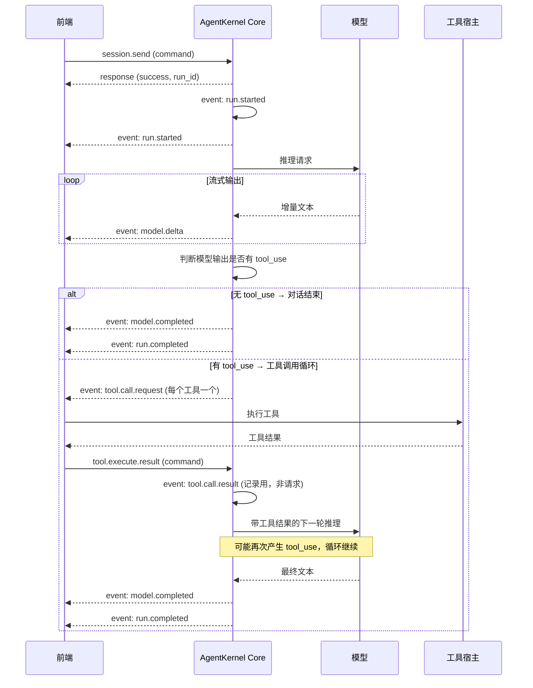
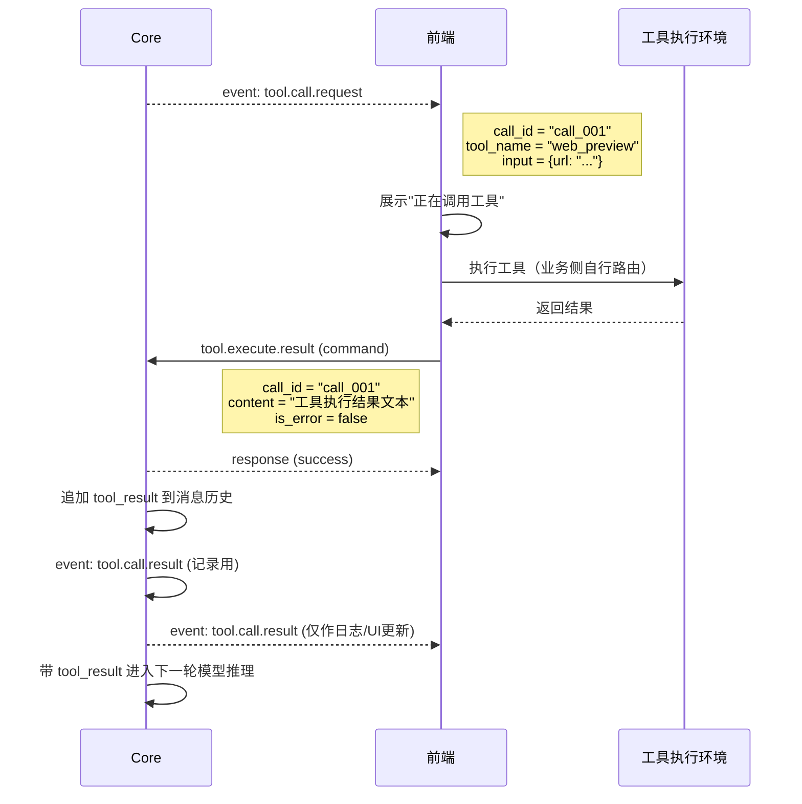
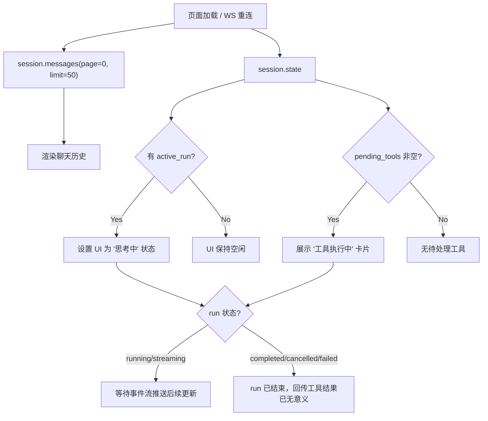
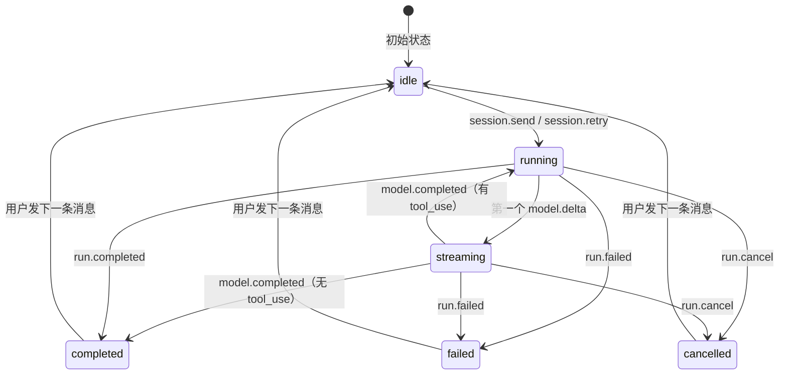

# 前端通讯指南：消息与工具链

> 面向前端开发者。只覆盖"发消息 → 接收事件 → 工具调用 → 刷新恢复"这条核心链路。会话管理、工具注册、供应商配置等不在本文范围内。

---

## 1. 核心概念

### 1.1 消息类型

所有 WS 消息都是 JSON，通过 `type` 字段区分：

| type | 方向 | 说明 |
|------|------|------|
| `command` | 前端 → Core | 请求（发送消息、查询状态等） |
| `response` | Core → 前端 | 命令的同步响应 |
| `event` | Core → 前端 | 运行时异步事件（流式输出、工具调用等） |
| `stream` | Core → 前端 | 心跳（ping/pong） |

### 1.2 关联 ID

| 字段 | 说明 |
|------|------|
| `session_id` | 会话 ID，所有消息和事件都属于某个 session |
| `run_id` | 一次对话执行的唯一 ID，从 `session.send` 开始到 `run.completed` 结束 |
| `request_id` | 前端生成的命令请求 ID，用于匹配 response |
| `call_id` | 单次工具调用的唯一 ID，用于配对 `tool.call.request` 和 `tool.execute.result` |

### 1.3 一次完整对话的事件流



---

## 2. 发送消息

### 2.1 `session.send`

发送用户消息，启动一次对话 run。

```json
{
  "command": "session.send",
  "request_id": "r1",
  "session_id": "my_session",
  "payload": {
    "message": "帮我查一下今天的天气",
    "images": [],
    "audio": [],
    "max_repeated_tool_calls": 10
  }
}
```

| 字段 | 必填 | 说明 |
|------|------|------|
| `message` | 是 | 用户文本消息 |
| `images` | 否 | base64 图片数组，支持 `data:image/png;base64,...` 或纯 base64 |
| `audio` | 否 | 音频数组，每项含 `data`（base64）和 `format`（如 `"wav"`） |
| `max_repeated_tool_calls` | 否 | 同一工具相同参数连续调用上限，默认 10，超出视为死循环 |

**同步响应**（command 的 response）：

```json
{
  "type": "response",
  "request_id": "r1",
  "success": true,
  "payload": {
    "session_id": "my_session",
    "run_id": "run_abc123",
    "status": "completed",
    "content": "今天北京天气晴...",
    "usage": { "input_tokens": 1200, "output_tokens": 350 },
    "tool_calls_made": 1
  }
}
```

> **重要**：`session.send` 的 response 是在 run 全部结束后才发送的。run 过程中的所有状态变化通过 event 推送，不要等 response 才更新 UI。

### 2.2 `session.retry`

重试上一次对话，不追加新用户消息。用于模型返回空响应或工具调用失败后的重试。

```json
{
  "command": "session.retry",
  "request_id": "r2",
  "session_id": "my_session",
  "payload": {
    "max_repeated_tool_calls": 10
  }
}
```

事件流与 `session.send` 完全一致。

---

## 3. 接收事件

所有事件都是 `{ "type": "event", "event": "...", "session_id": "...", "run_id": "...", "payload": {...} }` 格式。前端收到后按 `event` 字段分发处理。

### 3.1 `run.started`

run 开始。用于标记 UI 进入"思考中"状态。

```json
{
  "type": "event",
  "event": "run.started",
  "session_id": "my_session",
  "run_id": "run_abc123",
  "payload": {
    "provider": "openai",
    "model": "gpt-4o"
  }
}
```

### 3.2 `model.delta`

流式文本增量。**每个 delta 包含 `full_text`（累积全文）**，前端应使用 `full_text` 覆盖渲染，不要用 `delta` 拼接。

```json
{
  "type": "event",
  "event": "model.delta",
  "session_id": "my_session",
  "run_id": "run_abc123",
  "payload": {
    "delta": "今天北京",
    "full_text": "今天北京天气晴朗，",
    "event": "content"
  }
}
```

| payload 字段 | 说明 |
|------|------|
| `delta` | 本次增量文本 |
| `full_text` | 截至本次的累积全文（**用这个渲染**） |
| `event` | 事件子类型，通常为 `"content"` |

### 3.3 `model.completed`

模型输出完成。`content` 是最终完整文本。

```json
{
  "type": "event",
  "event": "model.completed",
  "session_id": "my_session",
  "run_id": "run_abc123",
  "payload": {
    "content": "今天北京天气晴朗，气温25°C..."
  }
}
```

### 3.4 `run.completed`

整个 run 结束（包括可能的多轮工具调用）。

```json
{
  "type": "event",
  "event": "run.completed",
  "session_id": "my_session",
  "run_id": "run_abc123",
  "payload": {
    "status": "completed",
    "input_tokens": 1200,
    "output_tokens": 350,
    "total_tokens": 1550,
    "tool_calls_made": 1,
    "duration_ms": 3200
  }
}
```

### 3.5 `run.failed`

run 失败（模型错误、工具循环等）。

```json
{
  "type": "event",
  "event": "run.failed",
  "session_id": "my_session",
  "run_id": "run_abc123",
  "payload": {
    "source": "provider",
    "stage": "model.stream",
    "retryable": false,
    "message": "API rate limit exceeded"
  }
}
```

### 3.6 `run.cancelled`

run 被用户取消（`run.cancel` 命令触发）。

```json
{
  "type": "event",
  "event": "run.cancelled",
  "session_id": "my_session",
  "run_id": "run_abc123",
  "payload": {
    "status": "cancelled",
    "tool_calls_made": 0,
    "duration_ms": 1500
  }
}
```

### 3.7 `checkpoint.applied`

上下文窗口自动裁剪触发。

```json
{
  "type": "event",
  "event": "checkpoint.applied",
  "session_id": "my_session",
  "run_id": "run_abc123",
  "payload": {
    "message_count": 35,
    "estimated_tokens": 180000,
    "window_tokens": 200000
  }
}
```

---

## 4. 工具调用

### 4.1 工具调用生命周期



### 4.2 `tool.call.request`（event，Core → 前端）

Core 请求前端执行工具。前端收到后需要：
1. 根据 `tool_name` 路由到对应的工具执行逻辑
2. 执行完成后回传 `tool.execute.result`

```json
{
  "type": "event",
  "event": "tool.call.request",
  "session_id": "my_session",
  "run_id": "run_abc123",
  "payload": {
    "tool_name": "web_preview",
    "call_id": "call_001",
    "input": { "url": "https://example.com" },
    "timeout_ms": 30000
  }
}
```

| payload 字段 | 说明 |
|------|------|
| `tool_name` | 工具名称，用于路由到对应执行逻辑 |
| `call_id` | 本次调用的唯一 ID，回传结果时必须一致 |
| `input` | 工具参数（JSON） |
| `timeout_ms` | 超时时间（毫秒），0 表示不限时 |

### 4.3 `tool.execute.result`（command，前端 → Core）

前端回传工具执行结果。

```json
{
  "command": "tool.execute.result",
  "request_id": "r3",
  "session_id": "my_session",
  "payload": {
    "call_id": "call_001",
    "content": "页面标题: Example Domain\n页面内容: ...",
    "is_error": false
  }
}
```

| payload 字段 | 必填 | 说明 |
|------|------|------|
| `call_id` | 是 | 与 `tool.call.request` 中的 `call_id` 一致 |
| `content` | 是 | 工具执行结果的文本内容 |
| `is_error` | 否 | 是否为错误结果，默认 `false` |

**Core 的同步 response**：

```json
{
  "type": "response",
  "request_id": "r3",
  "success": true,
  "payload": { "call_id": "call_001", "status": "submitted" }
}
```

> **关键**：Core 收到 `tool.execute.result` 后，会将其作为 `tool_result` 追加到消息历史，然后自动进入下一轮模型推理。前端不需要额外触发任何操作。

### 4.4 `tool.call.result`（event，Core → 前端）

Core 内部记录工具执行结果的事件，用于 UI 更新。**这不是要求前端执行工具，而是通知前端"工具已执行完"**。

```json
{
  "type": "event",
  "event": "tool.call.result",
  "session_id": "my_session",
  "run_id": "run_abc123",
  "payload": {
    "tool_name": "web_preview",
    "call_id": "call_001",
    "result": "页面标题: Example Domain...",
    "is_error": false
  }
}
```

### 4.5 多工具并行调用

模型可能在一次输出中请求多个工具调用。Core 会为每个 tool_use 发射独立的 `tool.call.request` 事件，前端需要并发处理，每个工具独立回传 `tool.execute.result`。

```
model 输出: [tool_use_A, tool_use_B, tool_use_C]
    ↓
Core 发射:
  tool.call.request (call_id=call_A)
  tool.call.request (call_id=call_B)
  tool.call.request (call_id=call_C)
    ↓
前端并发执行，逐个回传:
  tool.execute.result (call_id=call_A)
  tool.execute.result (call_id=call_B)
  tool.execute.result (call_id=call_C)
    ↓
Core 全部收齐后，合并 tool_result，进入下一轮推理
```

---

## 5. 页面刷新恢复

### 5.1 `session.state`（command，前端 → Core）

页面刷新后，用一条命令获取 session 的完整状态快照。

```json
{
  "command": "session.state",
  "request_id": "r_state",
  "session_id": "my_session"
}
```

**响应**：

```json
{
  "type": "response",
  "request_id": "r_state",
  "success": true,
  "payload": {
    "session_id": "my_session",
    "active_run": {
      "run_id": "run_abc123",
      "status": "running",
      "duration_ms": 3200
    },
    "pending_tools": [
      { "call_id": "call_001", "tool_name": "web_preview" }
    ],
    "recent_messages": [
      {
        "message_id": "msg_005",
        "role": "assistant",
        "run_id": "run_abc123",
        "has_tool_use": true,
        "has_tool_result": false,
        "content": [{"type": "tool_use", "id": "call_001", "name": "web_preview", "input": {"url": "..."}}],
        "created_at": "2026-06-15T10:30:00Z"
      }
    ],
    "context": {
      "message_count": 42,
      "estimated_tokens": 18500,
      "window_tokens": 200000,
      "usage_percent": 9.25
    },
    "seed_count": 2
  }
}
```

### 5.2 刷新恢复流程



### 5.3 pending_tools 的含义

`pending_tools` 表示消息历史中有 `tool_use` 但没有对应 `tool_result` 的工具调用。

**前端收到 pending_tools 后的行为**：

- 如果 `active_run` 存在且 status 为 `running` → 工具仍在等待中，展示等待状态。后续通过 `forward_run_events` 会收到 `tool.call.request` 或 `run.completed`
- 如果 `active_run` 不存在或 run 已结束 → run 中断了（如连接断开），pending 的工具调用不会再被请求执行

### 5.4 `events.subscribe`（可选，多前端场景）

如果需要让前端 B 观察前端 A 发起的对话，可以调用 `events.subscribe`：

```json
{
  "command": "events.subscribe",
  "request_id": "r_sub",
  "session_id": "my_session",
  "payload": { "since_seq": 0 }
}
```

调用后，该 session 的所有事件（包括其他连接发起的 send 产生的事件）会实时推送到本连接。

> **注意**：如果本连接自己也发起了 `session.send`，`events.subscribe` 会导致同一事件推送两次（一次来自 run 级转发器，一次来自 session 级订阅）。**单前端场景不要调用 `events.subscribe`**，`forward_run_events` 已经覆盖了本连接发起的 run 的事件推送。

---

## 6. 前端状态管理要点

### 6.1 Run 状态机



### 6.2 事件处理优先级

前端应按以下顺序处理事件：

1. **`run.started`** → 设置 run 状态，进入 loading
2. **`model.delta`** → 流式渲染文本（用 `full_text` 覆盖，不用 `delta` 拼接）
3. **`model.completed`** → 文本渲染完成
4. **`tool.call.request`** → 展示工具调用卡片，执行工具，回传结果
5. **`tool.call.result`** → 更新工具卡片为"已完成"
6. **`run.completed`** / `run.failed` / `run.cancelled` → run 结束，重置 loading 状态

### 6.3 避免重复执行工具

`tool.call.request` 可能在以下场景重复到达：
- 页面刷新后重新订阅事件流
- `events.subscribe` 和 `forward_run_events` 同时激活

前端应以 `call_id` 为 key 做去重：如果同一个 `call_id` 已经在执行中或已回传结果，忽略重复的 `tool.call.request`。

### 6.4 并发保护

同一 session 不允许并发 send。如果尝试在 run 进行中发消息，Core 会返回错误：

```json
{
  "success": false,
  "error": "session 'my_session' already has an active run (run_abc123), wait for it to complete or cancel it first"
}
```

前端应在 UI 上禁用发送按钮（run 进行中时），或提供取消按钮（`run.cancel`）。
