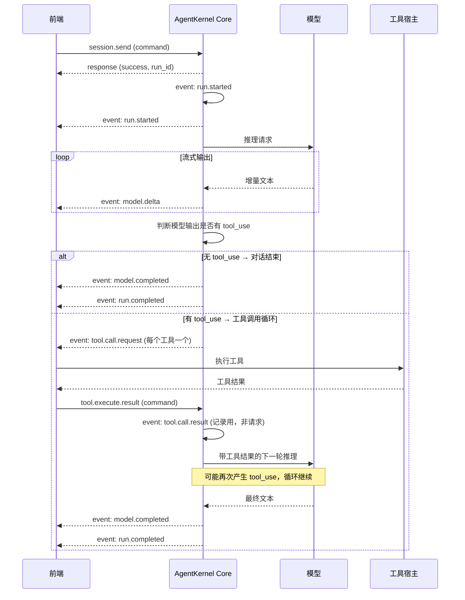
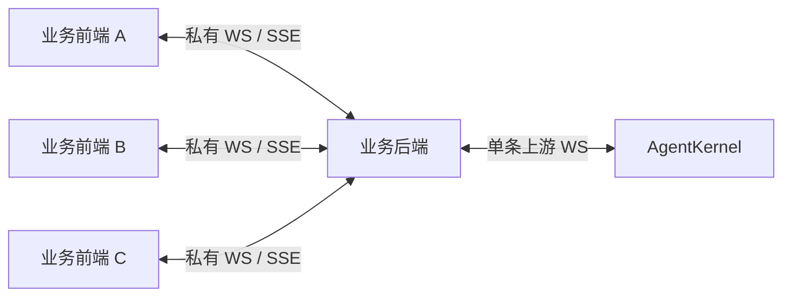
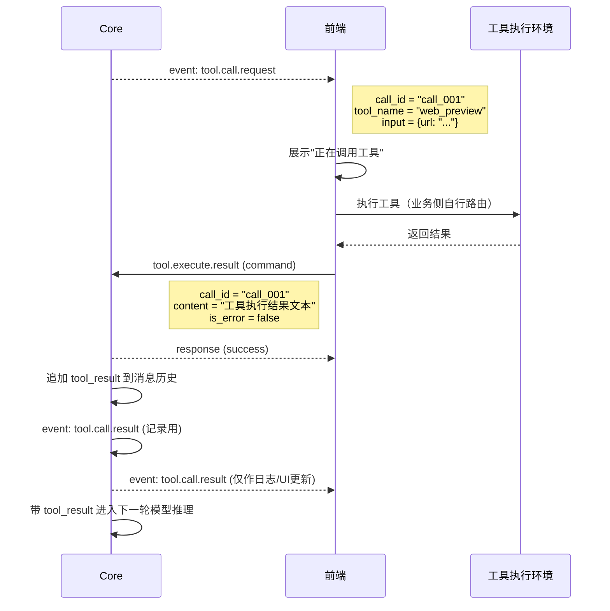
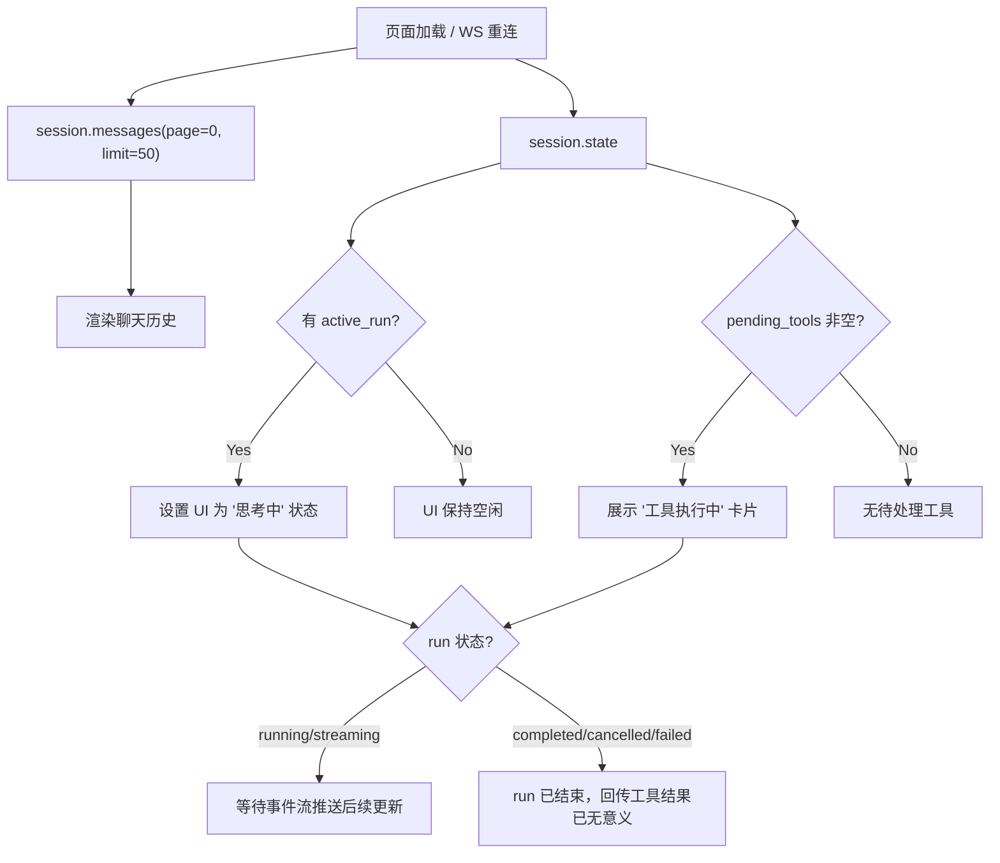
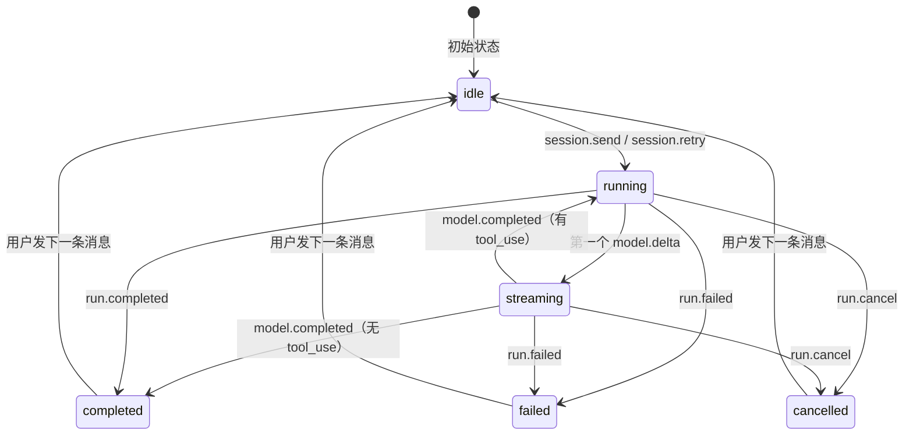

# 前端通讯指南：消息与工具链

> 面向前端开发者与业务后端开发者。只覆盖"发消息 → 接收事件 → 工具调用 → 刷新恢复"这条核心链路。会话管理、工具注册、供应商配置等不在本文范围内。
>
> 本文按推荐生产架构编写：`业务前端 <-> 业务后端私有 WS/推送协议 <-> AgentKernel WS`。测试页可直接连接 AgentKernel，但生产场景建议由业务后端作为唯一上游连接。

---

## 1. 核心概念

### 1.1 消息类型

所有 WS 消息都是 JSON，通过 `type` 字段区分：

| type | 方向 | 说明 |
|------|------|------|
| `command` | 前端 → Core | 请求（发送消息、查询状态等） |
| `response` | Core → 前端 | 命令的同步响应 |
| `event` | Core → 前端 | 运行时异步事件（流式输出、工具调用等） |
| `stream` | Core → 前端 | 心跳（ping/pong） |

### 1.2 关联 ID

| 字段 | 说明 |
|------|------|
| `session_id` | 会话 ID，所有消息和事件都属于某个 session |
| `run_id` | 一次对话执行的唯一 ID，从 `session.send` 开始到 `run.completed` 结束 |
| `request_id` | 前端生成的命令请求 ID，用于匹配 response |
| `call_id` | 单次工具调用的唯一 ID，用于配对 `tool.call.request` 和 `tool.execute.result` |

### 1.3 一次完整对话的事件流



### 1.4 推荐生产架构

推荐把 `agentkernel` 当成"会话级事件源"，不要让业务前端大规模直接连接它。



职责建议如下：

- `AgentKernel` 负责：接收命令、执行 run、产出 `session_id` 维度的实时事件流、请求工具执行、接收工具结果
- `业务后端` 负责：维护一条或少量上游 WS、跟踪"哪些前端正在看哪些 session"、把 AgentKernel 事件按 `session_id` 分发给正确的前端、处理权限与鉴权
- `业务前端` 负责：把用户操作通过私有协议发给业务后端、消费业务后端转发的事件并更新 UI

### 1.5 三类 ID 的实际职责

在推荐架构下，这三个字段的职责建议这样理解：

- `session_id`：前后端私有协议里的主路由键。你们业务后端应该按它做页面订阅分发
- `run_id`：一次推理执行生命周期标识。用于把 `run.started`、`model.delta`、`tool.call.request`、`run.completed` 关联到同一轮执行
- `request_id`：命令响应配对键。主要用于业务后端知道"这条 response 对应哪次主动请求"

换句话说：

- 页面级广播看 `session_id`
- 一轮推理过程看 `run_id`
- 命令应答配对看 `request_id`

---

## 2. 发送消息

### 2.1 `session.send`

发送用户消息，启动一次对话 run。

```json
{
  "command": "session.send",
  "request_id": "r1",
  "session_id": "my_session",
  "payload": {
    "message": "帮我查一下今天的天气",
    "images": [],
    "audio": [],
    "max_repeated_tool_calls": 10
  }
}
```

| 字段 | 必填 | 说明 |
|------|------|------|
| `message` | 是 | 用户文本消息 |
| `images` | 否 | base64 图片数组，支持 `data:image/png;base64,...` 或纯 base64 |
| `audio` | 否 | 音频数组，每项含 `data`（base64）和 `format`（如 `"wav"`） |
| `max_repeated_tool_calls` | 否 | 同一工具相同参数连续调用上限，默认 10，超出视为死循环 |

**同步响应**（command 的 response）：

```json
{
  "type": "response",
  "request_id": "r1",
  "success": true,
  "payload": {
    "session_id": "my_session",
    "run_id": "run_abc123",
    "status": "completed",
    "content": "今天北京天气晴...",
    "usage": { "input_tokens": 1200, "output_tokens": 350 },
    "tool_calls_made": 1
  }
}
```

> **重要**：`session.send` 的 response 是在 run 全部结束后才发送的。run 过程中的所有状态变化通过 event 推送，不要等 response 才更新 UI。
>
> 在推荐生产架构下，业务前端通常不直接看这条 response，而是由业务后端接收后，按自己的私有协议决定是否需要回给发起页面。

### 2.2 `session.retry`

重试上一次对话，不追加新用户消息。用于模型返回空响应或工具调用失败后的重试。

```json
{
  "command": "session.retry",
  "request_id": "r2",
  "session_id": "my_session",
  "payload": {
    "max_repeated_tool_calls": 10
  }
}
```

事件流与 `session.send` 完全一致。

---

## 3. 接收事件

所有事件都是 `{ "type": "event", "event": "...", "session_id": "...", "run_id": "...", "payload": {...} }` 格式。前端收到后按 `event` 字段分发处理。

### 3.1 `message.added`

会话新增消息事件。当前推荐用它把用户刚发送的消息实时同步到其他正在查看同一 `session` 的页面。

```json
{
  "type": "event",
  "event": "message.added",
  "session_id": "my_session",
  "run_id": "run_abc123",
  "payload": {
    "message_id": "msg_xxx",
    "role": "user",
    "content": "你好"
  }
}
```

### 3.2 `run.started`

run 开始。用于标记 UI 进入"思考中"状态。

```json
{
  "type": "event",
  "event": "run.started",
  "session_id": "my_session",
  "run_id": "run_abc123",
  "payload": {
    "provider": "openai",
    "model": "gpt-4o"
  }
}
```

### 3.3 `model.delta`

流式文本增量。**每个 delta 包含 `full_text`（累积全文）**，前端应使用 `full_text` 覆盖渲染，不要用 `delta` 拼接。

```json
{
  "type": "event",
  "event": "model.delta",
  "session_id": "my_session",
  "run_id": "run_abc123",
  "payload": {
    "delta": "今天北京",
    "full_text": "今天北京天气晴朗，",
    "event": "content"
  }
}
```

| payload 字段 | 说明 |
|------|------|
| `delta` | 本次增量文本 |
| `full_text` | 截至本次的累积全文（**用这个渲染**） |
| `event` | 事件子类型，通常为 `"content"` |

### 3.3 `model.completed`

模型输出完成。`content` 是最终完整文本。

```json
{
  "type": "event",
  "event": "model.completed",
  "session_id": "my_session",
  "run_id": "run_abc123",
  "payload": {
    "content": "今天北京天气晴朗，气温25°C..."
  }
}
```

### 3.4 `run.completed`

整个 run 结束（包括可能的多轮工具调用）。

```json
{
  "type": "event",
  "event": "run.completed",
  "session_id": "my_session",
  "run_id": "run_abc123",
  "payload": {
    "status": "completed",
    "input_tokens": 1200,
    "output_tokens": 350,
    "total_tokens": 1550,
    "tool_calls_made": 1,
    "duration_ms": 3200
  }
}
```

### 3.5 `run.failed`

run 失败（模型错误、工具循环等）。

```json
{
  "type": "event",
  "event": "run.failed",
  "session_id": "my_session",
  "run_id": "run_abc123",
  "payload": {
    "source": "provider",
    "stage": "model.stream",
    "retryable": false,
    "message": "API rate limit exceeded"
  }
}
```

### 3.6 `run.cancelled`

run 被用户取消（`run.cancel` 命令触发）。

```json
{
  "type": "event",
  "event": "run.cancelled",
  "session_id": "my_session",
  "run_id": "run_abc123",
  "payload": {
    "status": "cancelled",
    "tool_calls_made": 0,
    "duration_ms": 1500
  }
}
```

### 3.7 `checkpoint.applied`

上下文窗口自动裁剪触发。

```json
{
  "type": "event",
  "event": "checkpoint.applied",
  "session_id": "my_session",
  "run_id": "run_abc123",
  "payload": {
    "message_count": 35,
    "estimated_tokens": 180000,
    "window_tokens": 200000
  }
}
```

---

## 4. 工具调用

### 4.1 工具调用生命周期



### 4.1.1 推荐的工具调用归属

在推荐生产架构下，建议不要让多个业务前端页面直接各自决定是否执行工具，而是让业务后端统一决定工具执行归属。

建议：

- `AgentKernel -> 业务后端`：收到 `tool.call.request`
- `业务后端`：根据 `tool_name`、租户、会话归属、页面活跃状态，决定由谁执行
- `业务后端 -> AgentKernel`：统一回传 `tool.execute.result`
- `业务前端`：更多承担展示职责，而不是直接成为唯一工具执行主体

这样做的好处：

- 避免多个前端页面同时抢同一个 `call_id`
- 工具权限控制集中在后端
- 断线重连、超时补偿、审计记录都更容易做

### 4.2 `tool.call.request`（event，Core → 前端）

Core 请求前端执行工具。前端收到后需要：
1. 根据 `tool_name` 路由到对应的工具执行逻辑
2. 执行完成后回传 `tool.execute.result`

```json
{
  "type": "event",
  "event": "tool.call.request",
  "session_id": "my_session",
  "run_id": "run_abc123",
  "payload": {
    "tool_name": "web_preview",
    "call_id": "call_001",
    "input": { "url": "https://example.com" },
    "timeout_ms": 30000
  }
}
```

| payload 字段 | 说明 |
|------|------|
| `tool_name` | 工具名称，用于路由到对应执行逻辑 |
| `call_id` | 本次调用的唯一 ID，回传结果时必须一致 |
| `input` | 工具参数（JSON） |
| `timeout_ms` | 超时时间（毫秒），0 表示不限时 |

### 4.3 `tool.execute.result`（command，前端 → Core）

前端回传工具执行结果。

```json
{
  "command": "tool.execute.result",
  "request_id": "r3",
  "session_id": "my_session",
  "payload": {
    "call_id": "call_001",
    "content": "页面标题: Example Domain\n页面内容: ...",
    "is_error": false
  }
}
```

| payload 字段 | 必填 | 说明 |
|------|------|------|
| `call_id` | 是 | 与 `tool.call.request` 中的 `call_id` 一致 |
| `content` | 是 | 工具执行结果的文本内容 |
| `is_error` | 否 | 是否为错误结果，默认 `false` |

**Core 的同步 response**：

```json
{
  "type": "response",
  "request_id": "r3",
  "success": true,
  "payload": { "call_id": "call_001", "status": "submitted" }
}
```

> **关键**：Core 收到 `tool.execute.result` 后，会将其作为 `tool_result` 追加到消息历史，然后自动进入下一轮模型推理。前端不需要额外触发任何操作。

### 4.4 `tool.call.result`（event，Core → 前端）

Core 内部记录工具执行结果的事件，用于 UI 更新。**这不是要求前端执行工具，而是通知前端"工具已执行完"**。

```json
{
  "type": "event",
  "event": "tool.call.result",
  "session_id": "my_session",
  "run_id": "run_abc123",
  "payload": {
    "tool_name": "web_preview",
    "call_id": "call_001",
    "result": "页面标题: Example Domain...",
    "is_error": false
  }
}
```

### 4.5 多工具并行调用

模型可能在一次输出中请求多个工具调用。Core 会为每个 tool_use 发射独立的 `tool.call.request` 事件，前端需要并发处理，每个工具独立回传 `tool.execute.result`。

```
model 输出: [tool_use_A, tool_use_B, tool_use_C]
    ↓
Core 发射:
  tool.call.request (call_id=call_A)
  tool.call.request (call_id=call_B)
  tool.call.request (call_id=call_C)
    ↓
前端并发执行，逐个回传:
  tool.execute.result (call_id=call_A)
  tool.execute.result (call_id=call_B)
  tool.execute.result (call_id=call_C)
    ↓
Core 全部收齐后，合并 tool_result，进入下一轮推理
```

---

## 5. 页面刷新恢复

### 5.1 `session.state`（command，前端 → Core）

页面刷新后，用一条命令获取 session 的完整状态快照。

```json
{
  "command": "session.state",
  "request_id": "r_state",
  "session_id": "my_session"
}
```

**响应**：

```json
{
  "type": "response",
  "request_id": "r_state",
  "success": true,
  "payload": {
    "session_id": "my_session",
    "active_run": {
      "run_id": "run_abc123",
      "status": "running",
      "duration_ms": 3200
    },
    "pending_tools": [
      { "call_id": "call_001", "tool_name": "web_preview" }
    ],
    "recent_messages": [
      {
        "message_id": "msg_005",
        "role": "assistant",
        "run_id": "run_abc123",
        "has_tool_use": true,
        "has_tool_result": false,
        "content": [{"type": "tool_use", "id": "call_001", "name": "web_preview", "input": {"url": "..."}}],
        "created_at": "2026-06-15T10:30:00Z"
      }
    ],
    "context": {
      "message_count": 42,
      "estimated_tokens": 18500,
      "window_tokens": 200000,
      "usage_percent": 9.25
    },
    "seed_count": 2
  }
}
```

### 5.2 刷新恢复流程



### 5.3 pending_tools 的含义

`pending_tools` 表示消息历史中有 `tool_use` 但没有对应 `tool_result` 的工具调用。

**前端收到 pending_tools 后的行为**：

- 如果 `active_run` 存在且 status 为 `running` → 工具仍在等待中，展示等待状态。后续通过 `forward_run_events` 会收到 `tool.call.request` 或 `run.completed`
- 如果 `active_run` 不存在或 run 已结束 → run 中断了（如连接断开），pending 的工具调用不会再被请求执行

### 5.4 `events.subscribe`（AgentKernel 上游订阅）

如果需要接收一个或多个 `session` 的实时事件，业务后端应向 AgentKernel 调用 `events.subscribe`。

单 session 兼容写法：

```json
{
  "command": "events.subscribe",
  "request_id": "r_sub",
  "session_id": "my_session",
  "payload": { "since_seq": 0 }
}
```

批量订阅推荐写法：

```json
{
  "command": "events.subscribe",
  "request_id": "r_sub_batch",
  "session_id": "",
  "payload": {
    "session_ids": ["session_1", "session_2"],
    "mode": "replace",
    "since_seq": 0
  }
}
```

调用后，所有被订阅 `session` 的事件都会实时推送到当前这条上游连接。

当前实现按"单连接订阅集合 replace"处理：

- 同一条 WS 连接维护一组已订阅 `session`
- 每次 `events.subscribe` 都会用新集合替换旧集合
- 如果某个 `session` 已在当前订阅集合内，服务端会抑制该 `session` 的 run 级临时转发，避免重复推送

对业务后端的建议：

- 如果上游只维护一条 AgentKernel WS，可以直接把当前所有活跃页面关注的 `session_id` 聚合成一个集合，用 `mode=replace` 持续重建订阅集合
- 业务后端应自己维护"当前上游应订阅哪些 session"，而不是让业务前端直接理解 AgentKernel 的订阅模型
- 在当前版本下，前端页面是否打开、几个页面打开、谁该收到回显，都是业务后端私有协议层的职责，不应下沉到 AgentKernel

### 5.5 前后端私有通讯协议建议

业务前端与业务后端之间，建议使用显式的 `type + session_id + payload` 私有协议，而不是把 AgentKernel 的原始包直接透传给浏览器。

建议字段：

- `type`：消息类型，例如 `session.watch`、`session.unwatch`、`session.send`、`session.event`
- `session_id`：会话路由键
- `request_id`：前端请求唯一 ID，用于配对业务后端响应
- `run_id`：可选，前端需要细分本轮执行时再透出
- `payload`：业务负载

推荐的前端 -> 后端私有消息：

```json
{
  "type": "session.watch",
  "request_id": "req_watch_1",
  "session_id": "session_2",
  "payload": {}
}
```

```json
{
  "type": "session.send",
  "request_id": "req_send_1",
  "session_id": "session_2",
  "payload": {
    "message": "帮我总结这段内容"
  }
}
```

推荐的后端 -> 前端私有消息：

```json
{
  "type": "session.event",
  "session_id": "session_2",
  "run_id": "run_xxx",
  "payload": {
    "event_type": "model.delta",
    "event": {
      "delta": "正在分析...",
      "full_text": "正在分析..."
    }
  }
}
```

```json
{
  "type": "session.response",
  "request_id": "req_send_1",
  "session_id": "session_2",
  "payload": {
    "status": "completed"
  }
}
```

后端推荐做的事情：

- 维护 `viewer_session_set`：记录每个前端连接当前正在查看哪些 `session`
- 维护 `session_viewers`：记录每个 `session` 当前有哪些前端连接在看
- 把 AgentKernel 上游事件按 `session_id` fan-out 给对应前端
- 把用户消息的本地回显、AI 增量、工具调用状态统一抽象成你们自己的前端协议事件
- 不要把 AgentKernel 的内部细节原样暴露给最终业务前端，特别是底层工具执行协议和调试字段

### 5.6 当前版本下的生产建议

如果你们当前业务后端只维护一条上游 WS，推荐这样使用：

- 后端维护一个当前活跃订阅集合，例如 `["session_1", "session_2"]`
- 每次有页面打开/关闭/切换会话时，后端重新计算集合，并向 AgentKernel 发送一次 `events.subscribe + mode=replace`
- 后端收到上游事件后，再按 `session_id` 转发给正确的业务前端连接

这意味着当前版本已经可以直接支撑：

- 单会话调试
- 单后端代理接入
- 一条上游 WS 观察多个 session
- 基于 `session_id` 的私有协议二次分发

例如：

- 前端 A 看 `session_1`
- 前端 B/C 同时看 `session_2`
- 后端只保留一条上游 WS

后端应把上游订阅集合维护为：

```json
["session_1", "session_2"]
```

随后由后端自行决定：

- `session_1` 的事件只转发给 A
- `session_2` 的事件转发给 B、C
- 如果 `session_2` 有用户消息、AI 回复、工具调用和工具结果，也都按你们私有协议广播给对应前端

---

## 6. 前端状态管理要点

### 6.1 Run 状态机



### 6.2 事件处理优先级

前端应按以下顺序处理事件：

1. **`run.started`** → 设置 run 状态，进入 loading
2. **`model.delta`** → 流式渲染文本（用 `full_text` 覆盖，不用 `delta` 拼接）
3. **`model.completed`** → 文本渲染完成
4. **`tool.call.request`** → 展示工具调用卡片，执行工具，回传结果
5. **`tool.call.result`** → 更新工具卡片为"已完成"
6. **`run.completed`** / `run.failed` / `run.cancelled` → run 结束，重置 loading 状态

### 6.3 避免重复执行工具

`tool.call.request` 可能在以下场景重复到达：
- 页面刷新后重新订阅事件流
- 客户端断线重连后又补拉历史事件

前端应以 `call_id` 为 key 做去重：如果同一个 `call_id` 已经在执行中或已回传结果，忽略重复的 `tool.call.request`。

### 6.4 并发保护

同一 session 不允许并发 send。如果尝试在 run 进行中发消息，Core 会返回错误：

```json
{
  "success": false,
  "error": "session 'my_session' already has an active run (run_abc123), wait for it to complete or cancel it first"
}
```

前端应在 UI 上禁用发送按钮（run 进行中时），或提供取消按钮（`run.cancel`）。
